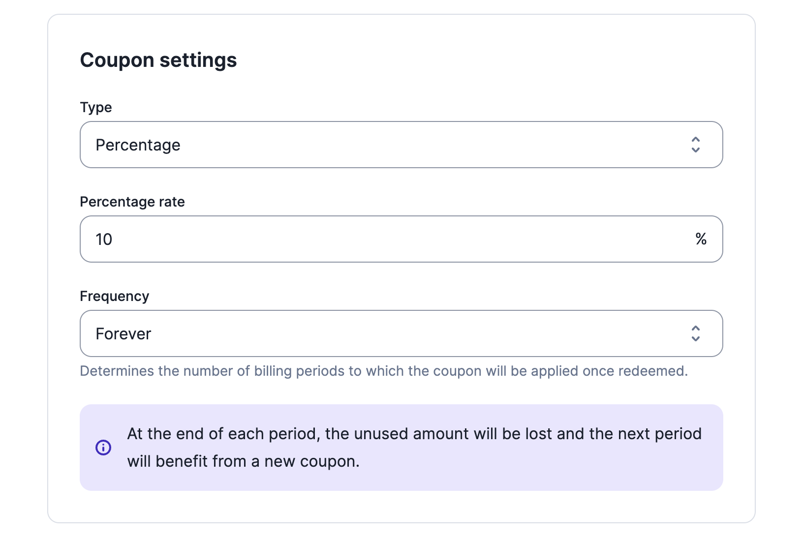

# Coupons that apply forever
When creating a coupon, through the [user interface](../docs/guide/coupons) or the [API](../docs/api/coupons/create-coupon), it is now possible to select the `forever` frequency.

Coupons with the `forever` frequency apply to all subscription invoices, regardless of the number of subscription invoices generated in a given period.

:::info
The value of the coupon is deducted from the amount of the invoice after tax.

Coupons do not apply to add-ons or any other one-off charges.
:::

