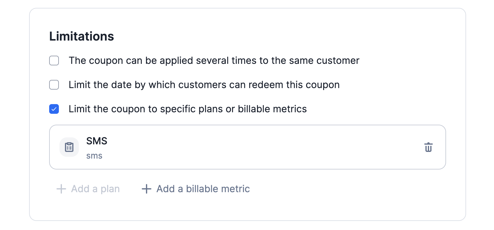

# Coupons limited to specific metrics
We have added a new option to the coupon settings: it is now possible to limit the application scope of a coupon to specific billable metrics.

By default, coupons apply to all charges but when creating a new coupon, you can define the list of billable metrics to which the coupon applies.

This feature is related to the `billable_metric_codes` attribute of the `coupon` object ([see API documentation](../docs/api/coupons/create-coupon)).

Please refer to [the guide](../docs/guide/coupons) for more information on coupons.

