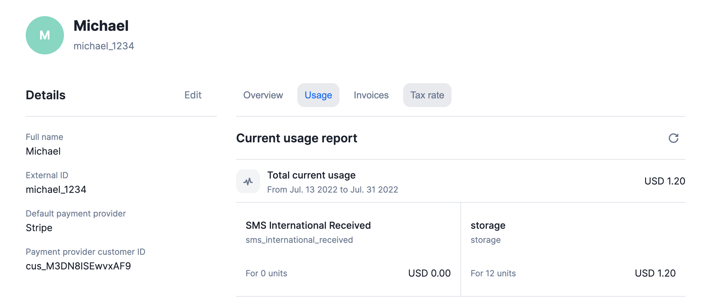

# Customer current usage

Good news for those who follow closely the consumption of their customers. You can now track the current billing usage of your customers either from the UI or from the API.

**To access this Usage tab:**
1. Access your list of **customers**;
2. Select a specific customer that is **already linked to a subscription**;
3. Access the **usage** tab; and
4. Get a complete view of **usage-based consumption** that is going to be billed on the next invoice.

On top of that, you can fetch the current usage of a customer directly from the API. To do so, you can access the following endpoint `GET /api/v1/customers/:customer_id/current_usage`