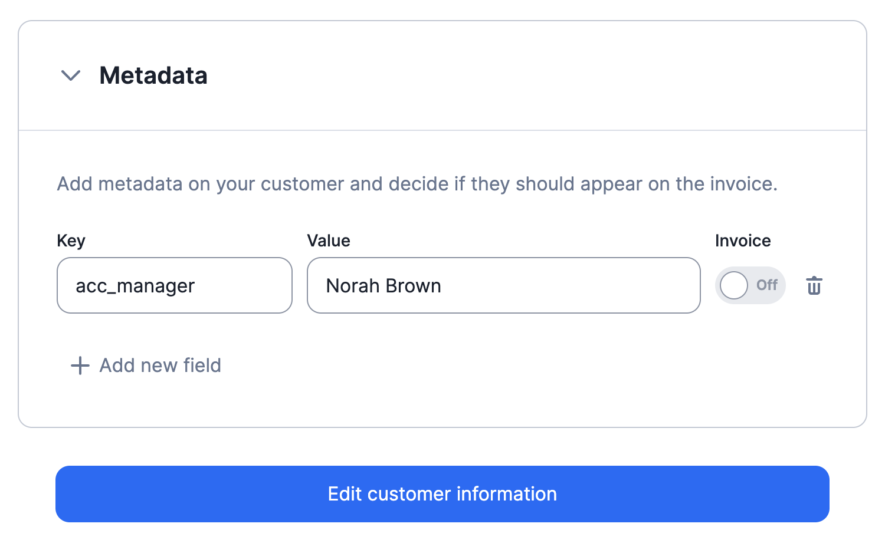

# Customer metadata
When creating or editing a customer, you can add metadata to store additional information (e.g. customer type, name of the account manager, etc.).

Customer metadata can be displayed on invoices, and can be managed via the user interface or the API.

[Learn more](../docs/guide/customers/metadata)

