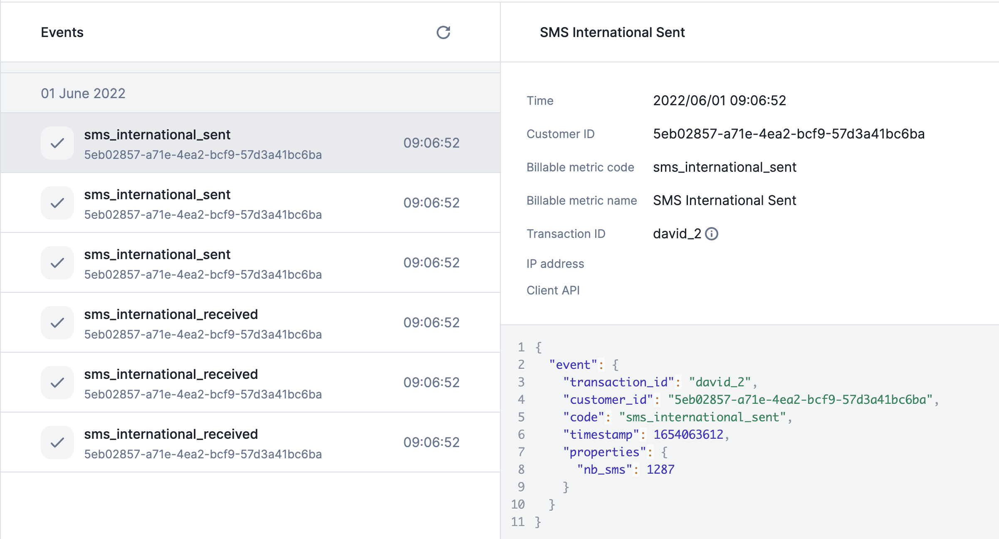

# Events list
You are now able to view all the ingested events sent from your application to Lago.
We called this feature `Events list` because it makes the event ingestion easier and more understandable.

1. Access the `Developer` sidebar item;
2. Click the `Events` tab; and
3. Take a look at the latest events ingested

:::tip
If an event you sent is not shown in the UI, it means that it has not been ingested by Lago
:::

This events list is also helpul to warn you for 2 specific cases:
1. **Warning 1** - The event code is not related to an existing billable metric
2. **Warning 2** - The property sent does not match the aggregation property defined in your billable metric

