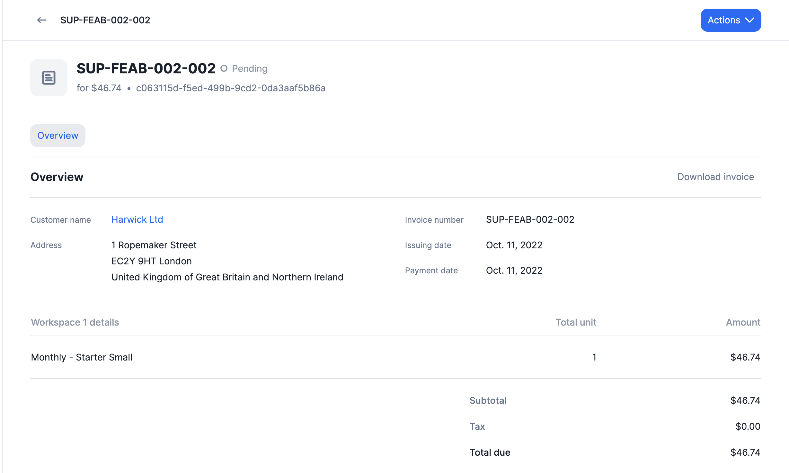

# Invoice details
To review the invoice details through the user interface:
1. Go to the **"Customers"** section;
2. Select a customer to open the customer view;
3. Open the **"Invoices"** tab; and
4. Click the invoice to see its details.

On the details page, you can download the invoice in PDF format and copy the invoice ID through the **"Actions"** dropdown in the upper right corner.

