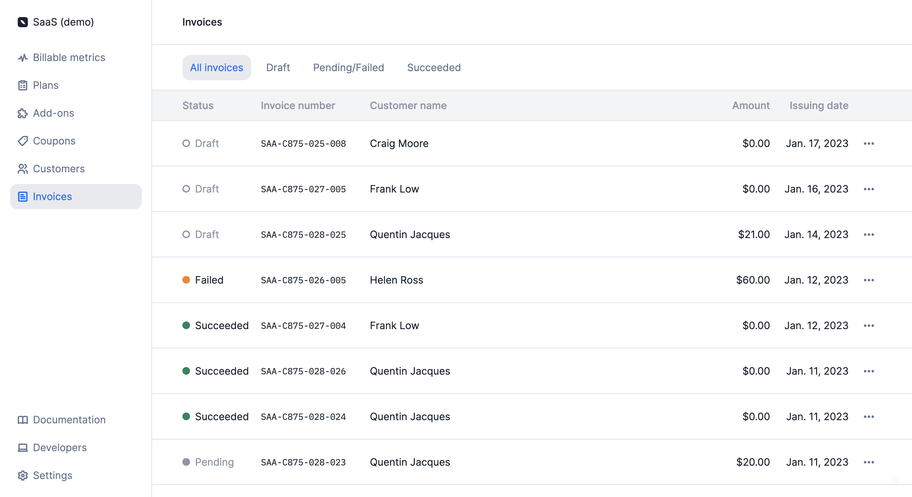

# Invoice list
We have added a new **"Invoices"** section, which allows you to access the list of invoices.

Invoices are filtered according to their status (i.e. `draft` or `finalized`) and according to their payment status (i.e. `succeeded`, `pending` or `failed`).

The same filters can be applied when [retrieving invoices via the API](../docs/api/invoices/get-all-invoices).

