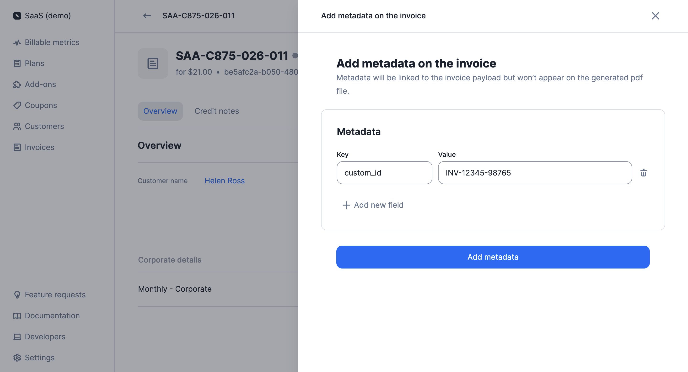

# Invoice metadata
After an invoice has been generated, you can add metadata to store additional information (e.g. custom ID, payment reference, etc.). This information will be included in the `invoice` object but will not be displayed on the PDF invoice.

Invoice metadata can be managed via the user interface or the API.

[Learn more](../docs/guide/invoicing/metadata)

