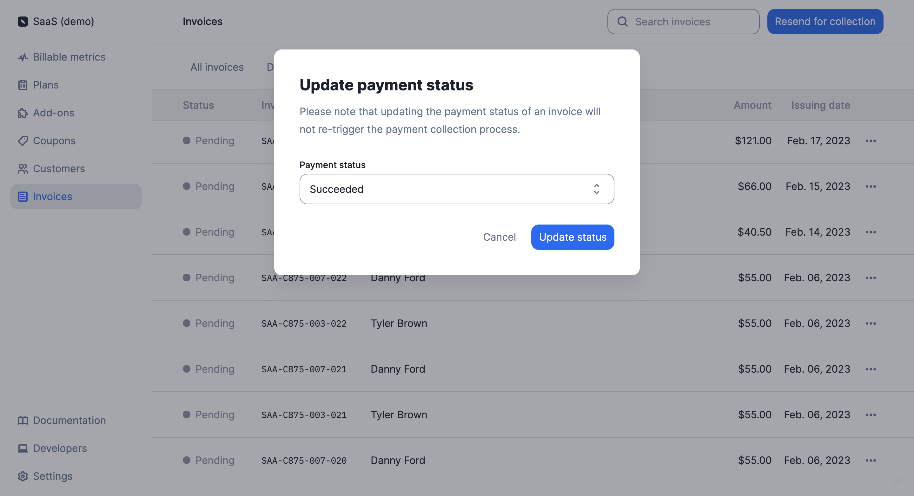

# Payment status updates
You can now update the payment status of an invoice through the user interface.

To do so:
1. Access the **"Invoices"** section;
2. Find the relevant invoice;
3. Click the ellipsis icon on the right;
4. Click **"Update payment status"**;
5. Select the new payment status; and
6. Click **"Update status"** to confirm.

This action can be performed [via the API](../docs/api/invoices/update-invoice) as well.

