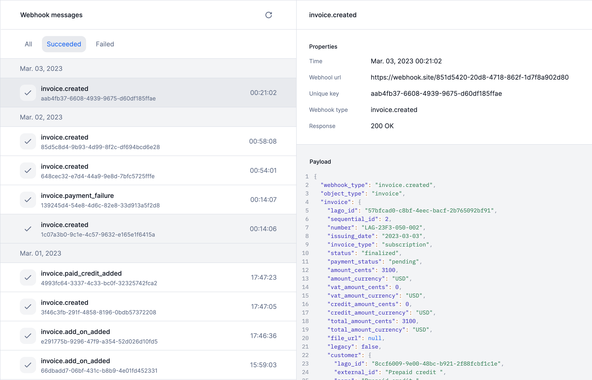

# Webhook logs
The new webhook management system allows you to access the list of webhook messages sent by Lago and check their status. You can re-trigger a message that has failed through the user interface.

To access the webhook logs:
1. Go to the **Developers** section via the sidebar;
2. Open the **Webhooks** tab; and
3. Click on the webhook endpoint to see the list of messages.

[Learn more](../docs/guide/webhooks)

