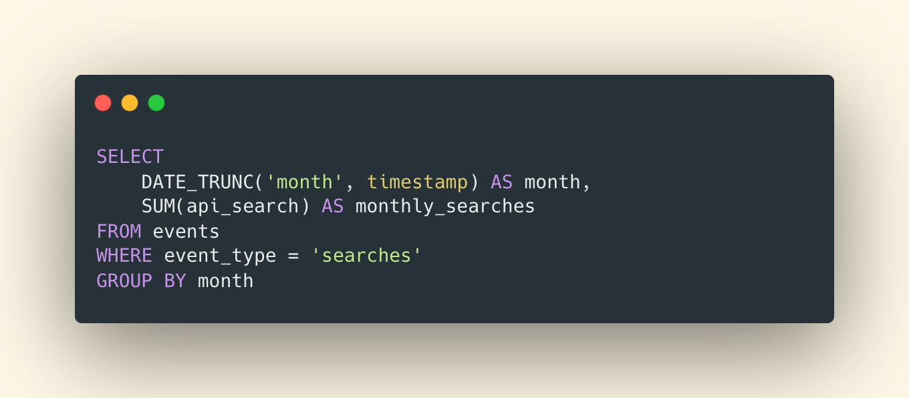

# Why Billing is a Nightmare

<head>
    <link rel="canonical" href="https://www.getlago.com/blog/why-billing-systems-are-a-nightmare-for-engineers" />
</head>

:::info
The original version of this article is available on [our blog](https://www.getlago.com/blog/why-billing-systems-are-a-nightmare-for-engineers).
:::

>*"On my first day, I was told: 'Payment will come later, shouldn't be hard right?'*
>
>*I was worried. We were not selling and delivering goods, but SSDs and CPU cores, petabytes and milliseconds, space and time. Instantly, via API. Fungible, at the smallest unit. On all continents. That was the vision.*
>
>*After a week, I felt like I was the only one really concerned about the long road ahead. In ambitious enterprise projects, complexity compounds quickly: multi-tenancy, multi-users, multi-roles, multi-currency, multi-tax codes, multi-everything. These systems were no fun, some were ancient, and often 'spaghetti-like'.*
>
>*What should have been a one-year R&D project ended up taking seven years of my professional life, in which I grew the billing team from 0 to 12 people. So yes, if you ask me, billing is hard. Harder than you think. It's time to solve that once and for all."*
>
>Kevin Deldycke, former VP Engineering at Scaleway

This is a typical conversation we have with engineers on a daily basis.

After my last post about my ['pricing hack'](https://www.getlago.com/blog/pricing-my-only-growth-hack-at-qonto), some of you asked me why billing was that complex. My co-founder Raffi took up the challenge of explaining why it's still an unsolved problem for engineers. 

We also gathered insights from other friends who went through the same painful journey, including Algolia, Segment, Pleo... don't miss them! Passing the mic to Raffi.

When you're thinking about automating billing, this means your company is getting traction. That's good news! 

You might then wonder: should we build it in-house? It does not look complex, and the logic seems specific to your business. Also, you might want to preserve your precious margins and therefore avoid existing billing solutions like Stripe Billing or Chargebee, that take a cut of your revenue. Honestly, who likes this 'rent-seeker' approach? 

Our team at Lago still has some painful memories of Qonto's internal billing system, that we had to build and maintain. Why was it so painful?  In this article, I will provide a high-level view of the technical challenges we faced while implementing hybrid pricing (based on subscription and usage) and what we learned during this journey.

## TL;DR: Billing is just 100x harder than you will ever think
"Let's bill yearly as well, should be pretty straightforward" claims the Revenue team. Great! Everyone is excited to start working on it. Everyone, except the Tech team. When you start building your internal billing system, it's hard to think of all the complexity that will pop up down the road, unless you've experienced it before.

It's common to start a business with a simple pricing. You define one or two price plans and limit this pricing to a defined number of features. However, when the company is growing, your pricing gets more and more complex, just like your entire codebase.

At Qonto, our first users could only onboard on a €9 plan. We quickly decided to add plans, and 'pay-as-you-go' features (e.g. ATM withdrawals, foreign currency payments, capital deposit, etc.) to grow revenue.

Also, as Qonto is a neobank, we wanted to charge our customers' wallets directly, through a ledger connected to our internal billing system. The team  started from a duo of full-time engineers building a billing system (which is already a considerable investment) to a dedicated cross-functional Pricing team.

This is not specific to Qonto of course. Pleo, another fintech unicorn from Denmark faced similar issues:

>*"I've learned to appreciate that billing systems are hard to build, hard to design, and hard to get working for you if you deviate from 'the standard' even by a tiny bit."*
>
>Arnon Shimoni, Product Billing Infrastructure Lead at Pleo

This is not even specific to fintechs. The Algolia team ended up creating a whole pricing department, now led by Djay, a pricing and monetization veteran from Twilio, VMWare, Service Now. They switched to a 'pay-as-you-go' pricing model based on the number of monthly API searches.

>*"It looks easy on paper — however, it's a challenge to bring automation and transparency to a customer, so they can easily understand. There is a lot of behind-the-scenes work that goes into this, and it takes a lot of engineering and investment to do it the right way."*
>
>Bernardette Nixon, CEO at Venture Beat

## Dates
When implementing a billing system, dealing with dates is often the number 1 complexity. Somehow, all your subscriptions and charges are based on a number of days. Whether you make your customers pay weekly, monthly or yearly, you need to define the billing period.

Here is a non-exhaustive list of difficulties for engineers:
1. How to deal with leap years?
2. Do your subscriptions start at the beginning of the month or at the creation date of the customer?
3. How many days/months of trial do you offer?
4. Who decided February only holds 28 days?
5. Wait, point 1 is also important for February...
6. How to calculate usage-based charges (price per second, hour, day)?
7. Do I resume the consumption or do I stack it month over month? Year over year?
8. Do I apply a pro-rata based on the number of days consumed by my customer?

Although every decision is reversible, billing cycle questions are often the most important source of customer support tickets, and iterating on them is quite complex. For instance, Qonto switched from 'anniversary' dates to calendar dates for its billing periods (see [here](https://medium.com/qonto-way/biller-migration-how-we-changed-our-billing-cycle-cf3c4cdd7cf4)). This change was not trivial.

## Upgrades & Downgrades
You need to allow your customers to upgrade or downgrade their subscriptions. Moving from plan A to plan B seems pretty easy, but it's not. Let's zoom on potential edge cases.

What should we do when the user:
1. Upgrades or downgrades in the middle of a period;
2. Has paid for the original plan in advance;
3. Needs to pay for the original plan in arrears;
4. Downgrades from a yearly plan to a monthly plan;
5. Upgrades from a monthly plan to a yearly plan;
5. Upgrades or downgrades from a plan paid in advance to a plan paid in arrears (and vice-versa); or
6. Has a discount and upgrades/downgrades?

We did not have a free trial period at the time at Qonto, but Arnon from Pleo describes this situation [here](https://arnon.dk/5-things-i-learned-developing-billing-system/).

## Usage-based computations
Subscription-based billing is the first step when implementing a billing system. Each customer needs to be affiliated to a plan in order to start charging the right amount at the right time.

But for a growing number of companies, like Qonto, other charges come alongside this subscription. These charges are based on what customers really consume. This is what we call 'usage-based billing'. Most companies end up having a hybrid pricing model: a monthly subscription fee and 'add-ons' or 'pay-as-you-go' charges on top of it.

These consumption-based charges are tough to track at scale, because they often come with calculation rules performed on a high volume of events.

Here are some examples:

Segment's pricing is based on the number of monthly tracked users. This means that they need to count the distinct number of users each month and reset this value to zero for the next billing period. In order to retrieve the number of unique visitors, they need to apply a 'distinct' function to deduplicate them.

Algolia tracks the number of API searches per month. This means they need to sum the number of monthly searches for each customer and reset this value to zero for the next billing period.

It becomes even more complex when you start calculating charges based on a timeframe. For instance, Snowflake charges for the compute usage of a data warehouse per second. This means that they sum the number of gigabytes or terabytes consumed, multiplied by the number of seconds of compute time.

Consider the example of a utility company that charges $10 per kilowatt of electricity per hour. The illustration below shows what needs to be modeled and automated by the billing system.

- **Hour 1**: 10 KW used for 0.5 hour = 5 KW (10 x 0.5)
- **Hour 2**: 20 KW used for 1 hour = 20 KW (20 x 1)
- **Hour 3**: 0 KW used for 1 hour = 0 KW (0 x 1)
- **Hour 4**: 30 KW used for 0.5 hour = 15 KW (30 x 0.5)
- **TOTAL** = 40 KW used x $10 ⇒ $40

## Idempotency done right
Billing errors sometimes occur. Charging a user twice for the same product is obviously bad for the customer experience, but failing to charge when needed hurts revenue. That's partly why Finance and BI teams spend so much time on revenue recognition.

For 'pay-as-you-go' companies, the billing system will process a high volume of events. When an event needs to be replayed, it needs to happen without billing the user again. Engineers call it 'idempotency', which means the **ability to apply the same operation multiple times without changing the result beyond the first try**.

It's a simple design principle, however, maintaining it at all times is hard.

## The case for a Cash Collection Officer
Cash collection is the process of collecting the money that customers owe you. The pet peeve of cash collection is dunning: when payments fail, the merchant needs to persist and make repeated payment requests to their customers, while trying not to damage the relationship.

At Qonto, we called these 'waiting funds'. A client's status was 'waiting funds' when they successfully went through the sign-up, KYC and KYB process but their account balance was still 0.

For a neobank, the impact is twofold: you can't charge your service fees (e.g. monthly subscription) and your customer does not generate interchange revenues (e.g. when you make a payment of $100 with your card, the card issuer earns $0.5-$1 of interchange revenue through the merchant's fees).

Therefore, your two main revenue streams are 'null' but you did pay to acquire, onboard, KYC the user and then to produce and send them a card. We often half-joked about the need to hire a 'chief waiting funds officer': the financial impact of this is just as high as the problem is underestimated.

All companies face dunning challenges. For engineers, on top of the billing architecture, this means that they need to design and build:
1. A **'retry logic'** to ask for a new payment intent;
2. An **invoice reconciliation system** (e.g. if several months of charges are recovered);
3. An **app logic to disable access** to the service; and
4. An **emailing workflow** to urge a user to proceed to the payment.

Some SaaS are even on a mission to fight dunnings and have built full-fledged companies around cash collection, such as Upflow, which is used by successful B2B scale-ups, including Front and Lattice.

>*"Sending quality and personalized reminders took us a lot of time and, as Lattice was growing fast, it was essential for us to scale our cash collection processes. We use Upflow to personalize how we ask our customers for money, repeatedly, while keeping a good relationship. We now collect 99% of our invoices, effortlessly."*
>
>Jason Lopez, Controller at Lattice

## The labyrinth of taxes and VAT
Taxes are challenging and depend on multiple dimensions. Taxes depend on what you are selling, your home country and your customer's home country. In the simplest situations, your tax decision tree should look like this:

Now, imagine that you sell different types of goods/services to different types of customers in 100+ countries. If you think the logic on paper looks complex, the engineering challenge is tenfold. Engineers need to think of an entire tax logic within the application. This pyramidal logic is based on customers and products, including:
1. **Taxes at company level**: your company will have a general tax rate that applies to all customers by default;
2. **Taxes at customer level**: the default tax rate can be overridden for each customer, depending on the dimensions mentioned above (see illustration); and
3. **Taxes at feature level**: this is mostly the case for the banking industry. At Qonto for instance, banking fees are not subject to taxes but a 20% VAT rate applies to non-banking features.

With billing, the devil's in the detail, which is why I always cringe when I see engineering teams build a home-made system, just because they think "it's not that complex".

If you've already tackled the topics listed above and think it's a good investment of your engineering time, go ahead and build it in-house, but make sure to budget for the maintenance work that is always needed. Another option is to rely on existing billing platforms, built by specialized teams.

To solve this problem at scale, we've adopted a radical approach: we're building an open-source billing API for product-led SaaS. Our API and architecture are open, so that you can embed, fork and customize them as much as your pricing and internal processes require.

If you're interested, you can [get started](https://www.getlago.com/get-started) here or [book a demo](https://pktz41848np.typeform.com/to/pUqoNimg).