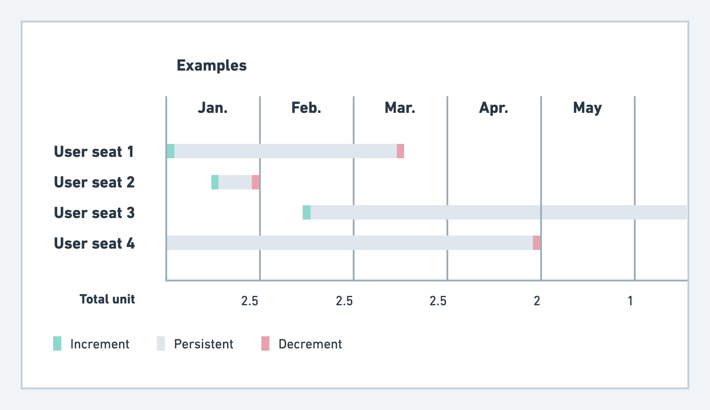

# Aggregation types

## Metered aggregation types

By selecting a **metered** aggregation type for a billable metric, the calculated units to be charged are resumed to 0 at the end of each billing period. These aggregation types, listed below, define how the ingested events are compiled and calculated at the end of a billable period.

Here is the full list of **metered aggregation types** currently supported officially by Lago.

| Aggregation | Description                                            | Transcription  |
| --------    | ------------------------------------------------------ | ------------------------- |
| **COUNT**   | Count the number of times an incoming event occurs     | `COUNT(event.code)` |
| **SUM**       | Sum a defined property for incoming events           | `SUM(event.properties.property_name)`
| **MAX**       | Get the maximum value of a defined property for incoming events              | `MAX(event.properties.property_name)` |
| **COUNT UNIQUE**  | Count the number of unique value of a defined property for incoming events |  `COUNT_DISTINCT(event.properties.property_name)` |

Except the `COUNT`(that is counting the number of times an event occurs), the other types aggregate over a single property of the event. **The result of this aggregation will be used to charge your customers.**

## Persistent aggregation types

By selecting a **persistent aggregation type** for a billable metric, the calculated units to be charged are persisted periods over periods, unless you or your customers decide to change it. This is very useful if you want to build a fair pricing model (ie: per-seat, or per-integration pricing for instance).

Here is the full list of **persistent aggregation types** currently supported officially by Lago.

| Aggregation | Description                                            | Transcription  |
| --------    | ------------------------------------------------------ | ------------------------- |
| **RECURRING COUNT**   | Count the number of unique value of a defined property for incoming events, **but persists the value period over period unless you change it**| `ADD(event.properties.property_name)` or  `REMOVE(event.properties.property_name)`|

- **Add**: this `operation_type` adds that item to the units to be charged at the end of the period. You don't need to send the event every billing period to charge your customers. The charge for this item is pro-rated for the first period.
- **Remove**: this `operation_type` removes that item to the units to be charged at the end of the period. It will not be taken into account for the next billing periods. The charge for this item is pro-rated for the last period.

On the image below, let's take back the example of a fair per-seats pricing.

:::tip
**Lago automatically created a pro-rated charge based on the number of days consumed by an item during a billing period.** An item that is added is persisted and charged period over period.
:::