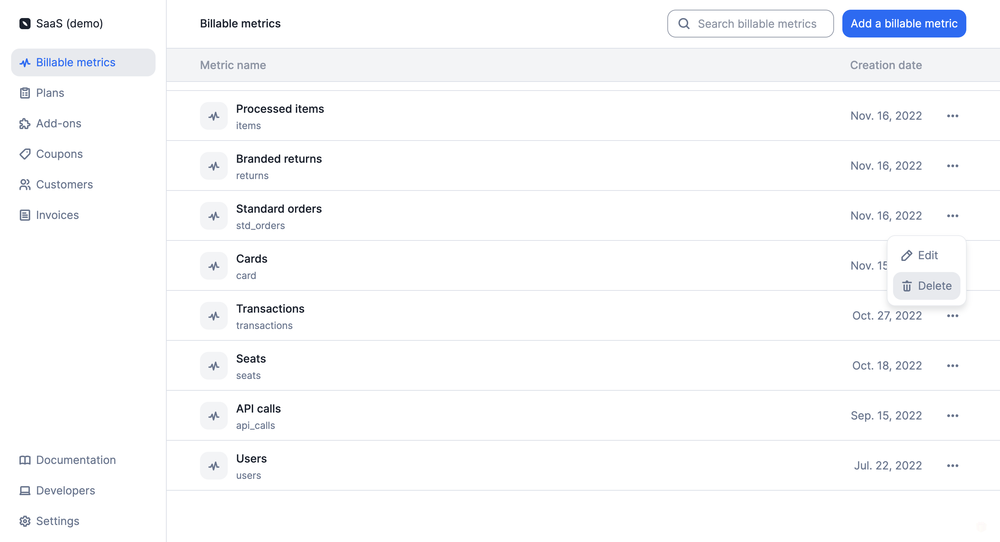

# Delete billable metrics
You may delete a billable metric linked to [charges](../plans/charges) associated with existing [subscriptions](../plans/subscription).

If you do so:
- The events associated with this billable metric, which are assigned to the current billing period or linked to `draft` invoices, will be immediately deleted;
- The charges associated with this billable metric will be immediately removed from all plans and existing subscriptions;
- The charges associated with this billable metric will no longer be included in the [current usage](../../api/customer_usage/customer-usage-object) of the customers concerned; and
- The charges associated with this billable metric will be immediately removed from all `draft` invoices linked to these subscriptions.

However, the charges associated with this billable metric will still be included in all `finalized` invoices linked to these subscriptions.

:::info
After deleting a billable metric, you can create a new one using the same code. However, past events will not be linked to this new billable metric.
:::

