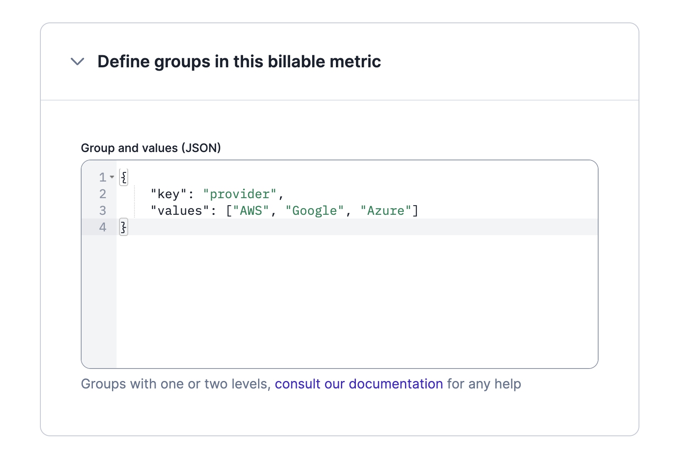
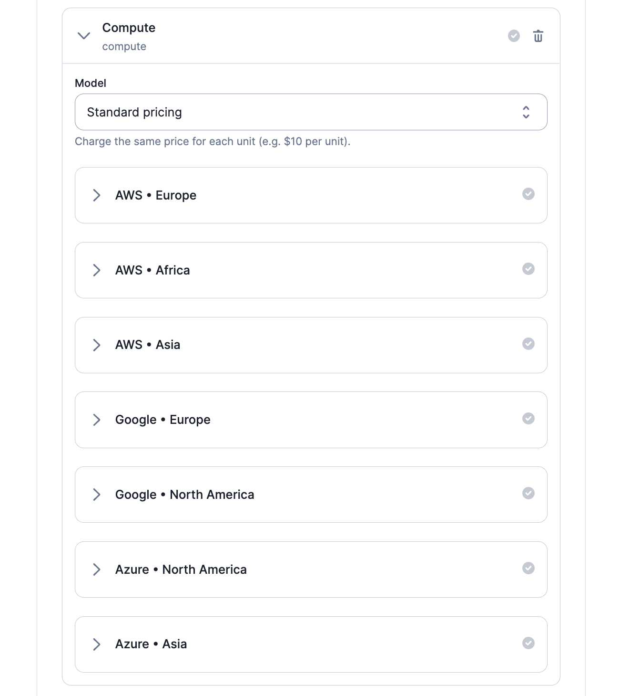

import Tabs from '@theme/Tabs';
import TabItem from '@theme/TabItem';

# Dimensions
When setting up your pricing, you may want to group events according to their property. To do so, you can create dimensions for your billable metric.

## Grouping with a single key
Consider the following example:

>Your company provides DevOps services and you want to charge your customers for compute capacity by the hour.
>
>In your Lago account, you create a `compute` billable metric that calculates the total number of hours (i.e. `SUM(properties.hours)`).
>
>As your customers can choose from different cloud providers, you need to group usage records (i.e. events) according to the provider.
>
>On the configuration page of your billable metric, you can define `"key": "provider"` and `"value": ["AWS","Google","Azure"]` to create the corresponding dimension (see snippet below).

```json title="JSON snippet for one dimension"
{
    "key": "provider",
    "values": ["AWS", "Google", "Azure"]
}
```



Below is an example of an event for the billable metric described above:

```json title="Event including a group value"
LAGO_URL="https://api.getlago.com"
API_KEY="__YOUR_API_KEY__"

curl --location --request POST "$LAGO_URL/api/v1/events" \
--header "Authorization: Bearer $API_KEY" \
--header 'Content-Type: application/json' \
--data-raw '{
      "event": {
          "transaction_id": "event_001",
          "external_customer_id": "customer_1234",
          "code": "compute",
          "timestamp": 1668461043,
          "properties": {
            "hours": 0.07,
            "provider": "Azure"
          }
      }
  }'
```

:::caution
Values are case-sensitive. If you don't use the exact value when pushing events, they will not be taken into account. Following our example: the expected value is `"Azure"` and `"azure"` is an invalid value.
:::

## Grouping with two keys
It is also possible to define two levels for grouping events. Following our previous example:

>In addition to their cloud provider, your customers can select their region.
>
>Therefore, you can define `"key": "region"` to add a second dimension (see snippet below).
>
>When creating a plan, you will then be able to add a [charge](../plans/charges) for each region available for each provider.

```json title="JSON snippet for two dimensions"
{
  "key": "provider",
  "values": [
    {
      "name": "AWS",
      "key": "region",
      "values": ["Europe", "Africa", "Asia"]
    },
    {
      "name": "Google",
      "key": "region",
      "values": ["Europe", "North America"]
    },
    {
      "name": "Azure",
      "key": "region",
      "values": ["North America", "Asia"]
    }
  ]
}
```

See below a screenshot of the corresponding charge when added to a plan. The same breakdown will be shown on the invoices sent to the customers.



Below is an example of an event for the billable metric described above:

```json title="Event including two group values"
LAGO_URL="https://api.getlago.com"
API_KEY="__YOUR_API_KEY__"

curl --location --request POST "$LAGO_URL/api/v1/events" \
--header "Authorization: Bearer $API_KEY" \
--header 'Content-Type: application/json' \
--data-raw '{
      "event": {
          "transaction_id": "event_002",
          "external_customer_id": "customer_1234",
          "code": "compute",
          "timestamp": 1668461044,
          "properties": {
            "hours": 0.13,
            "provider": "AWS",
            "region": "Europe"
          }
      }
  }'
```

You can also create billable metrics with dimensions [via the API](../../api/billable_metrics/create-billable-metric).