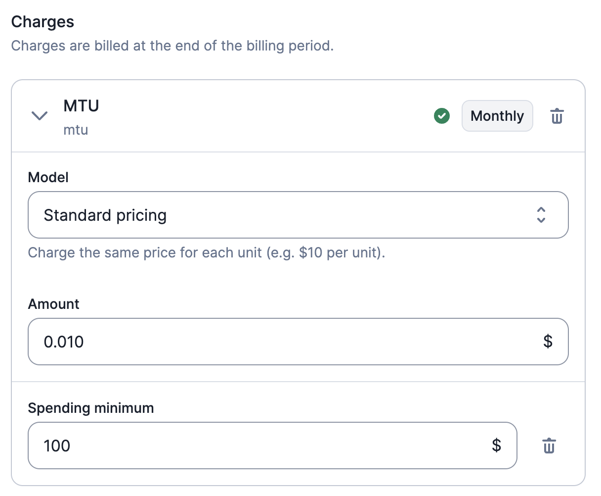
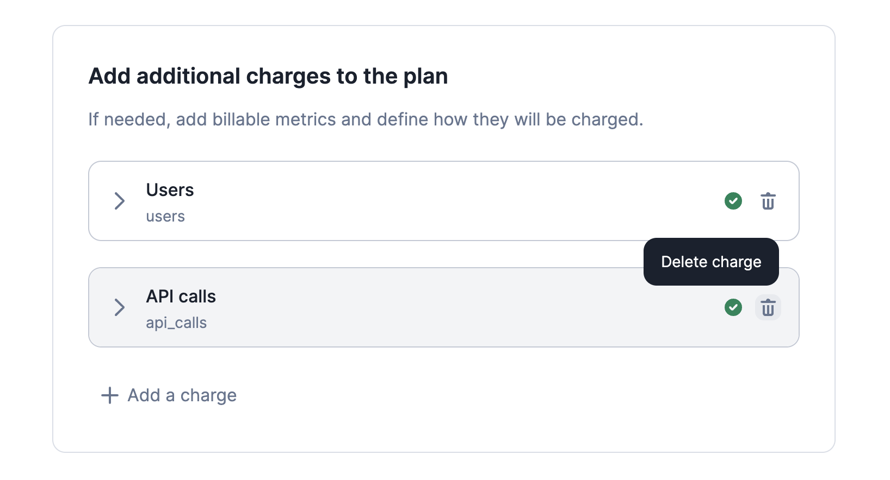

# Charges
In addition to the price of the plan, you can charge your customers for usage. For instance, you can create charges based on the number of API calls, the number of active users, transactions, compute time, etc. These additional charges relate to the [billable metrics](../billable-metrics/overview) defined previously.

## Overview of charges
You can add charges to a plan by calling an existing billable metric. These "pay-as-you-go" features can be linked to several plans.

:::info
- Charges are always paid in arrears as they are based on usage;
- Charges are denominated in the same currency as the plan; and
- The trial period does not apply to charges. The trial period only applies to the base amount of the plan.
:::

There are several price models available for charges (see below).

## Number of decimals
Lago allows you create charges with up to fifteen decimals (e.g. $0.000123456789123).

Please note that charges are invoiced in `amount_cents`. Therefore, Lago automatically rounds prices (e.g. USD 1102 `amount_cents` = $11.02).

## Charge models

### Standard charge model
Select the standard charge model if you want to charge the **same price for each unit** consumed.

Imagine that your API company charges $0.05 per API call (i.e. your billable metric). By selecting the standard charge model, you will define a fixed unit price. If a customer makes 1,000 API calls during the billing period, the total invoice amount will be $0.05 x 1,000 API calls = $50.

### Graduated charge model
Select the graduated charge model if you want to define **several price tiers**. This charge model allows you to apply a discount depending on the number of units consumed. You can also apply a **flat fee** to an entire tier.

Let's take back the example of the API company. You could charge $1 per unit for the first 100 units (first 100 API calls), then $0.50 per unit for the next 100 calls and finally, $0.10 for any additional unit.

Please refer to the tooltip in the user interface for more information.

### Package charge model
Select the package charge model if you want to apply a **fixed price to a range of units**. You also have the ability to offer free units.

Let's take back the example of our API company. You may want to charge $5 per 100 units and offer the first 100 units. In this example, 201 units would cost $0 (first 100 units) + $5 (next 100 units) + $5 (last unit) = $10.

### Percentage charge model
Select the percentage charge model if you want to apply a **percentage and a fixed fee on transactions** (e.g. bank transfers, ATM withdrawals, etc.).

This charge model is generally used with billable metrics that allow users to calculate the total amount of transactions (e.g. `sum` aggregation type and `amount` defined as the event property - [learn more](../billable-metrics/aggregation-types#2-sum)).

You can define several parameters for the percentage charge model, including:
- **Percentage rate**: charge rate that applies to the total amount (e.g. 1.2% on transactions);
- **Fixed fee (optional)**: fee that applies to each event ingested during the billing period (e.g. $0.10 per transaction);
- **Free units (events - optional)**: number of events that are not subject to the fixed fee; and
- **Free units (total amount - optional)**: amount that is not subject to the charge rate.

When free units are defined for both the total amount and number of events, Lago performs checks each time a new event is ingested to determine whether the free units still apply. In the illustration below for instance, the first 3 events or $500 are free.

Consider the following list of events:

| Event         | Amount | Total number of events         | Total amount     | Result     |
| ------------- | ------ | ------------------------------ | ---------------- | ---------- |
| Transaction 1 | $200   | 1 free event (out of 3)        | $200 ($500 free) | No charges |
| Transaction 2 | $100   | 2 free events (out of 3)       | $300 ($500 free) | No charges |
| Transaction 3 | $100   | 3 free events (out of 3)       | $400 ($500 free) | No charges |
| Transaction 4 | $50    | 4 events (free units exceeded) | $450 ($500 free) | Charge     |

Therefore, for the fourth transaction, the charge will be $0.10 x 1 event + 1.2% of $50 = $0.70.

### Volume charge model
Select the volume charge model if you want to define several price tiers but want to apply a **single unit price based on the total volume**. You can also apply a **flat fee** in addition to the unit price.

Consider the following example, where each unit represents an API call:

| Tier   | First unit | Last unit | Unit price | Fixed fee |
| ------ | ---------- | --------- | ---------- | --------- |
| Tier 1 | 0          | 10,000    | $0.0010    | $10       |
| Tier 2 | 10,001     | 50,000    | $0.0008    | $10       |
| Tier 3 | 50,001     | 100,000   | $0.0006    | $10       |
| Tier 4 | 100,001    | ∞         | $0.0004    | $10       |

In this case, 65,000 API calls would cost 65,000 x $0.0006 + $10 = $49.

## Charge spending minimum
Usage-based charges are always paid at the end of the billing period, based on the amount of consumption that occurred. However, you could possibly need to define a spending minimum that a customer needs to commit to.

If your customer spends less than the committed amount, you will **charge a true-up fee equal to the difference between the commitment and the actual usage**. Please note that this true-up fee is tied to the initial charge but will appear as a separate line item in an invoice or in a credit note.

**Spending minimums and true-up fees are always prorated** based on the number of days used in the subscription. This ensures fairness if your customer signs up at the end of the month, upgrades to a new plan, or terminates an ongoing subscription before the end of the period.

To define a charge spending minimum: 

1. Go to a Plan;
2. Add a usage-based charge;
3. Define a price model;
4. Click the **add a spending minimum** button; and
5. Define a spending minimum amount.

In the example below, a customer is billed based on Monthly Tracked Users (MTU), with a standard pricing of $0.010 per tracked users. However, the customer is committed to a spending minimum of $100. If the total consumption of MTUs for the period is $50, a true-up fee of $50 will be charged.

## Delete charges
You may delete a charge included in a plan associated with existing [subscriptions](../plans/subscription).

If you do so and save the change:
- The charge will be immediately removed from all subscriptions linked to this plan;
- The charge will no longer be included in the [current usage](../../api/customer_usage/customer-usage-object) of the customers concerned; and
- The charge will be immediately removed from all `draft` invoices associated with these subscriptions.

However, the charge will still be included in all `finalized` invoices associated with these subscriptions.

:::info
Deleting a charge does not delete the events associated with the corresponding billable metric. If later you decide to add the charge back into the plan, the events received before the deletion may be taken into account in the billing process (depending on the limits of the billing period).
:::

