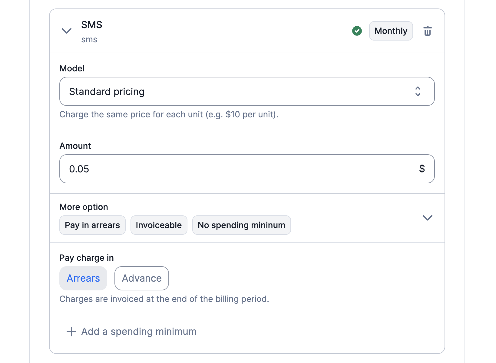
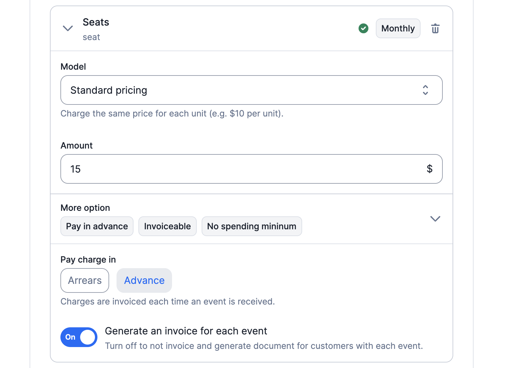

# Cadence & Invoicing

Usage-based charges can be billed in arrears (i.e. at the end of the period) or in advance (i.e. each time an event is ingested).

## Charges paid in arrears
If you opt for charges to be settled in arrears, they will be invoiced at the end of the billing period based on the actual usage during that period. This payment option is ideal for usage types like storage, API calls, or compute, where it is more practical to wait until the end of the period before billing. By default, all charges are configured to be billed in arrears.

**API configuration:**

To specify that charges of a plan should be billed in arrears using the API, you can use the `pay_in_advance` argument and set its value to `false`. More information about the [plan configuration](../../../api/plans/create-plan).

**User interface (UI) configuration:**

Alternatively, you can easily manage the billing settings through the user interface. Within the UI, you will find options to customize the invoice cadence by setting a charge as invoiced in arrears.

## Charges paid in advance
With this payment option, charges are invoiced immediately upon any changes in usage. It is particularly useful for scenarios where you need to bill customers instantly for usage-based actions, such as new user seat or integrations.

:::info
You can mark charges as paid in advance for billable metrics based on the `count_agg`, `sum_agg` and `unique_count_agg` aggregation types.

However, charges related to billable metrics based on the `max_agg` and `recurring_count_agg` aggregation types can only be paid in arrears.
:::

**API configuration:**

To specify that charges of a plan should be billed in advance using the API, you can use the `pay_in_advance` argument and set its value to `true`. More information about the [plan configuration](../../../api/plans/create-plan).

**User interface (UI) configuration:**

Alternatively, you can easily manage the billing settings through the user interface. Within the UI, you will find options to customize the invoice cadence by setting a charge as billed in advance, and thus invoiced immediately upon changes.

:::tip
You can use the `api/v1/events/estimate_fees` endpoint to estimate fees for charges to be paid in advance ([learn more](../../../api/events/estimate-fee)).
:::