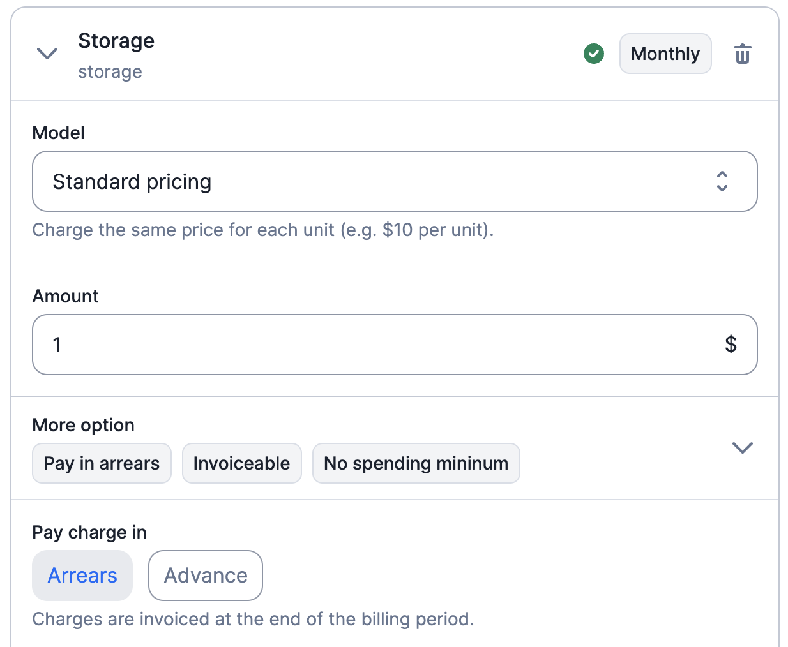

# Cadence & invoicing

Usage-based charges can be billed in arrears (at the end of the period), or in advance (directly upon usage changes).

## Charges Paid In-Arrears
If you opt for charges to be settled in arrears, they will be invoiced at the end of the billing period based on the actual usage during that period. This payment option is ideal for usage types like storage, API calls, or compute, where it is more practical to wait until the end of the period before billing. By default, all charges are configured to be billed in arrears.

**API Configuration:**

To specify that charges of a plan should be billed in arrears using the API, you can use the `pay_in_advance` argument and set its value to `false`. More information on [plan configuration](../../../api/plans/create-plan).

**User Interface (UI) Configuration:**

Alternatively, you can easily manage the billing settings through the user interface. Within the UI, you will find options to customize the invoice cadence by setting a charge as invoiced in arrears.

## Charges Paid In-Advance
With this payment option, charges are invoiced immediately upon any changes in usage. It is particularly useful for scenarios where you need to bill customers instantly for usage-related updates, such as user seat additions or integrations.

**API Configuration:**

To specify that charges of a plan should be billed in advance using the API, you can use the `pay_in_advance` argument and set its value to `true`. More information on [plan configuration](../../../api/plans/create-plan).

**User Interface (UI) Configuration:**

Alternatively, you can easily manage the billing settings through the user interface. Within the UI, you will find options to customize the invoice cadence by setting a charge as billed in advance, and thus invoiced immediately upon changes.
