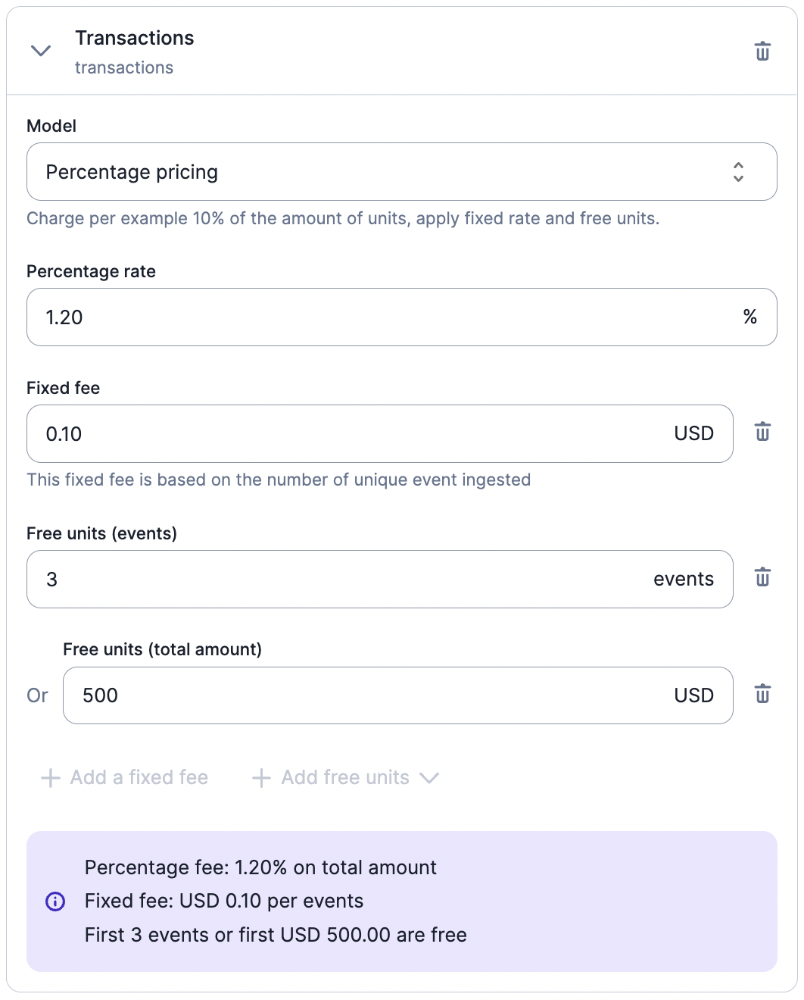

# Percentage

Select the percentage charge model if you want to apply a **percentage and a fixed fee on transactions** (e.g. bank transfers, ATM withdrawals, etc.).

This charge model is generally used with billable metrics that allow users to calculate the total amount of transactions (e.g. `sum` aggregation type and `amount` defined as the event property - [learn more](../../../billable-metrics/aggregation-types#2-sum)).

You can define several parameters for the percentage charge model, including:
- **Percentage rate**: charge rate that applies to the total amount (e.g. 1.2% on transactions);
- **Fixed fee (optional)**: fee that applies to each event ingested during the billing period (e.g. $0.10 per transaction);
- **Free units (events - optional)**: number of events that are not subject to the fixed fee; and
- **Free units (total amount - optional)**: amount that is not subject to the charge rate.

When free units are defined for both the total amount and number of events, Lago performs checks each time a new event is ingested to determine whether the free units still apply. In the illustration below for instance, the first 3 events or $500 are free.

Consider the following list of events:

| Event         | Amount | Total number of events         | Total amount     | Result     |
| ------------- | ------ | ------------------------------ | ---------------- | ---------- |
| Transaction 1 | $200   | 1 free event (out of 3)        | $200 ($500 free) | No charges |
| Transaction 2 | $100   | 2 free events (out of 3)       | $300 ($500 free) | No charges |
| Transaction 3 | $100   | 3 free events (out of 3)       | $400 ($500 free) | No charges |
| Transaction 4 | $50    | 4 events (free units exceeded) | $450 ($500 free) | Charge     |

Therefore, for the fourth transaction, the charge will be $0.10 x 1 event + 1.2% of $50 = $0.70.