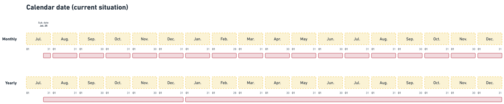
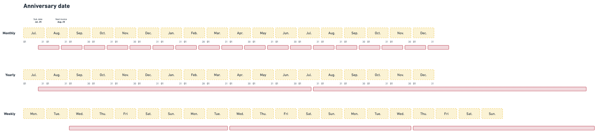
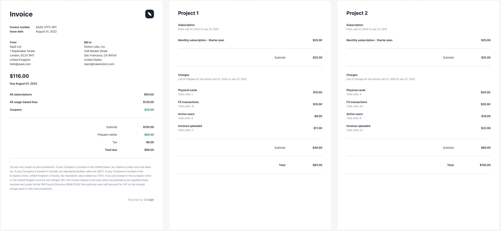

# Subscriptions
A [subscription](../../api/subscriptions/subscription-object) is created when a plan is assigned to a customer. You can assign a plan to a customer at any time (i.e. when the customer record is created or later on).

To assign a plan to a customer through the user interface:
1. Access the **"Customers"** section via the side menu;
2. Select a customer from the list;
3. In the **"Overview"** tab, click **"Add a plan"** on the right;
4. Select a plan and give a name to the subscription (name that will be displayed on the invoices - optional);
5. Choose whether the subscription should be renewed at the beginning of the period or on its anniversary date (see [below](subscription#billing-cycles)); and
5. Click **"Add plan"** to confirm.

When a subscription is active, Lago will automatically generate invoices for the customer according to the [plan model](./plan-model). It will also start monitoring the customer's consumption, which means that you can start pushing [events](../../api/events/metered-event) related to this subscription.

## Billing cycles

### Calendar billing period
By default, subscriptions are based on **calendar periods**. Therefore, if you assign a monthly plan to a customer on July 14th:
- The first invoice will be generated for the period July 14th to July 31st;
- The next invoice will be generated for the period August 1st to August 31st; and
- All future invoices will be generated for full calendar months.

When a subscription starts during the month, the subscription fee will be calculated on a **pro rata basis** according to the number of days.

Consider the following example:

>Your customer signs up for the Premium plan ($50 monthly) on August 10th.
>
>There are 22 days left until the end of the month (including August 10th). Therefore, the subscription fee for August is:
>
>22 days x $50 / 31 days = $35.48

### Anniversary Date billing period

However, you can choose to use the **anniversary date** of the subscription to define a custom billing period.

For example:

>Your customer signs up for the Premium plan on August 10th.
>
>If you choose to align the billing cycle with the anniversary date of the subscription, the customer will be billed every 10th of the month.
>
>The first billing period will run from August 10th to September 9th.

## Multiple plans
You may create several subscriptions for a customer by assigning them multiple plans. This can be particularly useful if your application allows customers to create different projects or workspaces (e.g. Free plan for Workspace 1, Free plan for Workspace 2, Premium plan for Workspace 3, etc.).

:::caution
There are some rules to keep in mind when assigning multiple plans to a customer:
1. All plans must be denominated in the same currency; and
2. You must specify the `external_subscription_id` for each event or create [batch events](../../api/events/create-batch-event).
:::

We recommend that you give each subscription a name when assigning multiple plans to a customer. The subscription names will make it easier to differentiate each plan and will also be displayed on the invoices.

When multiple subscriptions are linked to a customer, Lago will automatically consolidate invoices when possible.

|                  | Month 1 | Month 2 | Month 3 | Month 4 | (...) | Month 13 |
| ---------------- | ------- | ------- | ------- | ------- | ----- | -------- |
| Plan A (monthly) | $40     | $40     | $40     | $40     | (...) | $40      |
| Plan B (monthly) | $60     | $60     | $60     | $60     | (...) | $60      |
| Plan C (yearly)  | $500    | -       | -       | -       | (...) | $500     |
| Total invoice    | $600    | $100    | $100    | $100    | (...) | $600     |

It is possible to link to the same customer subscriptions that are based on different billing cycles (e.g. a subscription based on calendar dates and another based on the anniversary date).

In addition to this, please note that **coupons apply to all subscriptions**.

Below is an example of a consolidated invoice:

