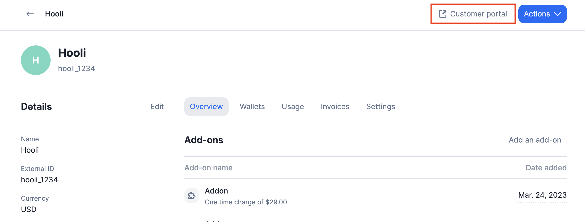
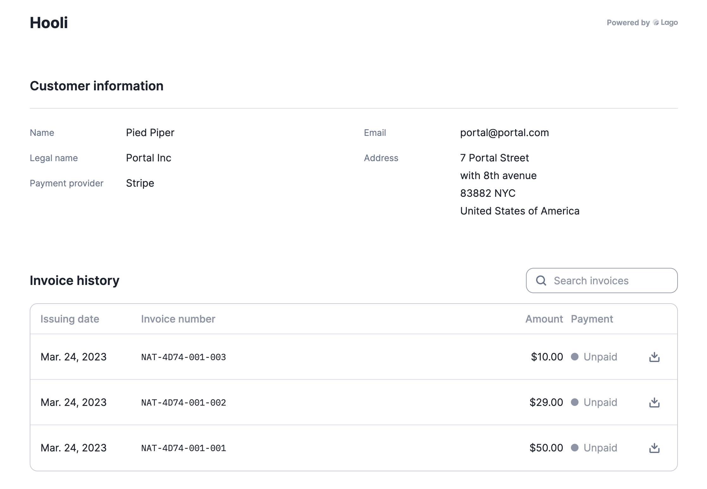

# Customer portal
The Lago Customer Portal is a user-friendly platform that allows you to effortlessly share billing information, such as past invoices, with your end customers. As we continue to develop this tool, you will be able to display even more useful information to your customers.

## Generate a Customer Portal link
To generate a Customer Portal URL that can be embedded in your product, you have two options:
1. Use the API endpoint; or
2. Click the Customer Portal link on a specific customer details view.

## Customer portal preferred language
By default, the embedded portal is displayed in English. However, you can easily change the language for a specific customer by adjusting the `document language` in their settings. To access this feature, follow these simple steps:

**To access document language settings**:
- Go to the specific customer's profile;
- Click the **Settings** tab;
- **Edit** the document language section; and
- Select the preferred language.

You can also update the language of a customer directly from the API.

:::note

If you would like to request a new supported language, please don't hesitate to contact our team.

:::

## Invoice history dashboard
The Customer Portal allows your customers to retrieve all past invoices and download them with ease. Lago displays useful billing information such as the issuing date, invoice number, amount, and payment status (paid or unpaid). Additionally, your customers can filter the list and search for a specific invoice.

## Embedding the dashboard
You can also use the API to generate an embeddable Customer Portal that can be displayed in your application by using an iframe. To do so, use the endpoint `/customers/:external_customer_id/portal_url` to generate an embeddable URL that can be displayed in your user interface.

:::info

**For security reasons**, the token returned by the API request expires every 12 hours. Therefore, it's crucial to use the endpoint and generate a new token every time a customer refreshes or accesses the embedded billing page.

:::