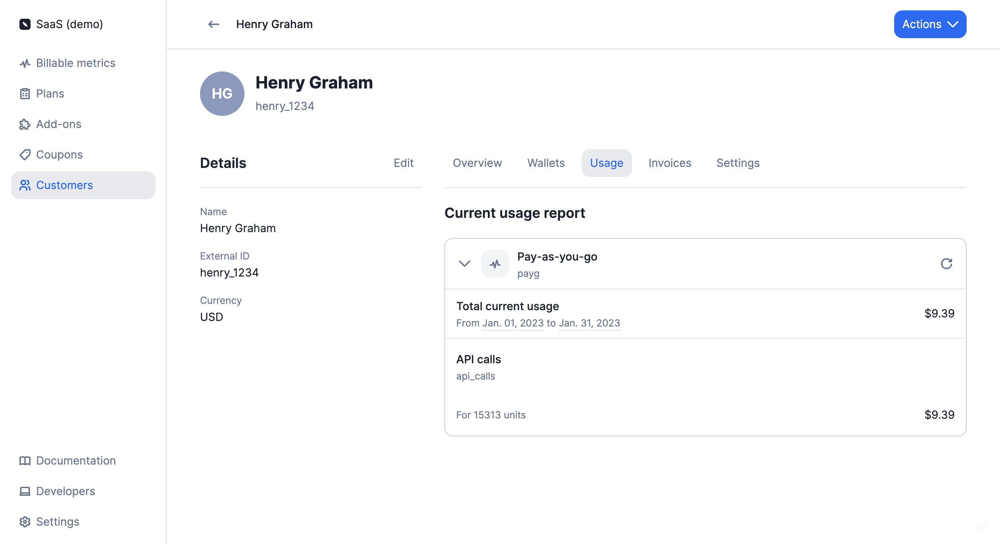

# Customer management

## Create and update a customer
To create a customer through the user interface, follow these steps:
1. Access the **"Customers"** section via the side menu;
2. Click **"Add a customer"** in the upper right corner;
3. Enter the customer's name and external ID (i.e. unique ID as defined in your backend system);
4. Select the customer's timezone (optional - [learn more](../customers/invoice_customer#timezone));
5. Enter the customer's billing information, including company information and address (optional);
6. Select the default payment provider for this customer (optional - [learn more](../payments/overview)); 
7. Add metadata if needed and choose whether or not to display it on the next invoices (optional); and
8. Click **"Create customer"** to confirm.

Once a customer is created, you can access the customer view, where you can edit their information.

:::caution
You cannot change the `external_id` of a customer after an object has been assigned to them (i.e. plan, coupon, add-on, wallet and credits).
:::

You can also [create and update customers](../../api/customers/create-customer) via the API.

## Assign objects to a customer
The usage monitoring and billing processes start when you assign a plan to a customer, which triggers a [subscription](../plans/subscription).

You can also apply [coupons](../coupons), [add-ons](../addons) and [prepaid credits](../prepaid_credits) to a customer account.

To assign objects to a customer through the user interface:
1. Access the **"Customers"** section via the side menu;
2. Select a customer from the list;
3. In the upper right corner of the customer view, click **"Actions"**; and
4. Select an action from the dropdown list.

## Monitor the customer's current usage
When a plan that includes usage-based charges is assigned to a customer, you can start pushing [events](../events/ingesting_events) associated with the customer account.

During the billing period, the customer's current usage is visible in the **"Usage"** tab of the customer view, including (but not limited to):
- Total amount for the period under consideration; and
- Breakdown by charge, including total number of billing units and amount.

You can retrieve the customer's current usage via the API using [this endpoint](../../api/customer_usage/customer-usage).

## Deleting a customer
You may delete a customer linked to existing objects (i.e. applied coupons, wallets, subscriptions, add-ons).

If you do so:
- All [subscriptions](../plans/subscription) associated with this customer account will be immediately terminated (this action may trigger the generation of invoices and/or credit notes);
- All [coupons](../coupons) applied to this customer account will be immeditely terminated;
- The customer's active [wallet](../prepaid_credits) will be immediately terminated and all remaining credits will be voided; and
- All `draft` invoices associated with this customer account will be immediately finalized.

`finalized` invoices and [credit notes](../credit_notes) associated with the deleted customer remain available in the **"Invoices"** section of the user interface and can also be retrieved via the API.

It is possible to generate new credit notes and process refunds after the deletion of the customer.

:::info
After deleting a customer account, you can create a new one using the same `external_id`.
:::