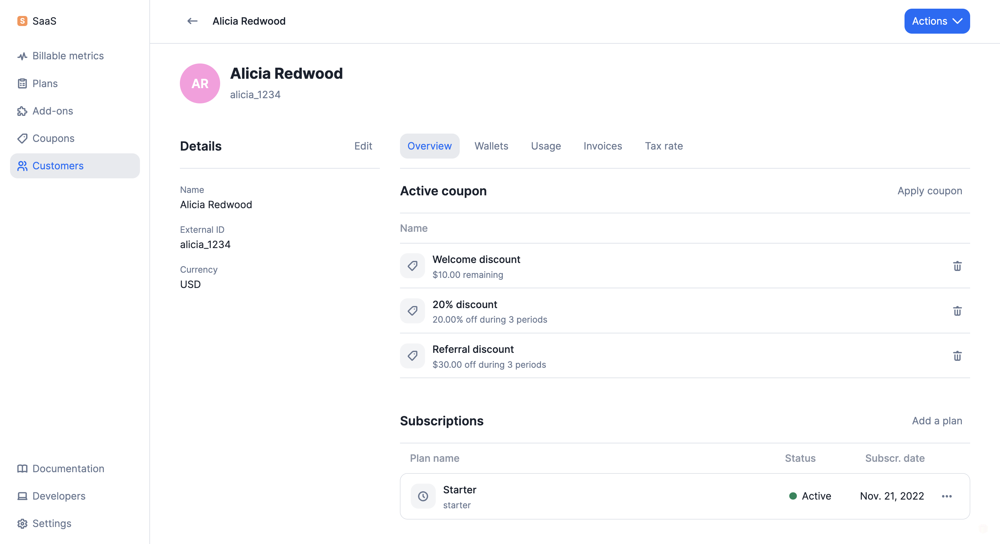

# Coupons
Coupons allow you to offer discounts to your customers. When you apply a coupon to a customer, its value will be deducted from their next invoice(s).

:::info
The value of the coupon is deducted from the amount of the invoice after tax.
:::

## Create coupons
To create a coupon through the user interface:
1. Access the **"Coupons"** section via the side menu;
2. Click **"Add a coupon"**;
3. Choose a name and a code for your coupon;
4. Select the type of coupon (i.e. fixed amount or percentage);
5. Define its value and frequency (i.e. will be applied once, over several periods or forever);
6. Choose if the coupon can be applied several times to the same customer account or not;
7. Choose whether or not to set an expiration date (i.e. date after which the coupon can no longer be redeemed); and
8. Click **"Add coupon"** to confirm.

:::info
The expiration date displayed in the app is based on the [organization's timezone](../../changelog/timezones).
:::

## Apply coupons
:::caution
If the currency of the customer is already defined, the currency of the coupon must be the same, otherwise you will not be able to apply the coupon to the customer account.
:::

To apply a coupon to a customer:
1. Select a customer from the list;
2. Click **"Actions"** in the upper-right corner and select **"Apply coupon"**;
3. Select a coupon; and
4. Click **"Apply coupon"** to confirm.

You can also apply coupons via the API ([learn more](../api/coupons/apply-coupon)).

:::info
You can apply several coupons to a customer. However, if a coupon has been marked as non-reusable, you will only be able to apply it once to the customer account, even if it has not been fully consumed.

A coupon applied to a customer continues to apply beyond the expiration date.
:::

## Application scope
**Coupons are deducted from the total amount of the following invoice(s)**, including subscription fees and charges. As mentioned previously, the value of the coupon is deducted from the amount of the invoice after tax.

For coupons whose value is a fixed amount:
- When the coupon only applies once and its value is higher than the invoice amount, the remaining unused amount will be applied to the following invoices, until the coupon is totally consumed or removed; and
- When the coupon is recurring and its value is higher than the invoice amount, any remaining unused amount will be lost, even if it is the last application period.

When several coupons are applied to the customer account, they will be deducted according to the date on which they were applied: **the coupon that was applied first will be deducted first**.

You can see the remaining value / number of remaining periods for each coupon in the **"Overview"** tab of the customer view.

:::info
Coupons do not apply to add-ons or any other one-off charges.
:::

## Edit, terminate and delete coupons
In the coupon view, you can click the **ellipsis icon** to see all available actions:
1. **Edit**: allows you to modify the name, code and settings of the coupon;
2. **Terminate**: allows you to deactivate the coupon so that it cannot be applied to any new customer (customers to whom the coupon has already been applied continue to benefit from it); and
3. **Delete**: allows you to delete the coupon and remove it from the list (this action cannot be undone).

:::info
You cannot modify the code, value and frequency of a coupon, or delete it, if it has already been applied to a customer.
:::

## Remove coupons
To remove a coupon that has been applied to a customer and is still active:
1. Select the customer;
2. Locate the coupon under **"Overview"**;
3. Click the **bin icon** on the right; and
4. Click **"Remove coupon"** to confirm.

The coupon will instantly disappear from the customer view and will not be applied to the next invoice.