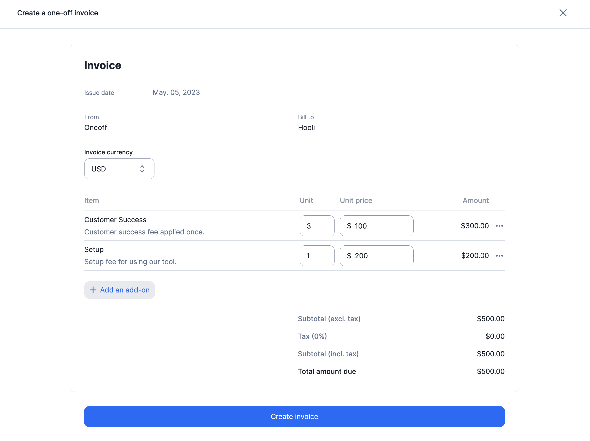

# Create one-off invoices from add-ons

One-off invoices allow you to bill immediately one or several add-ons to a customer. This guide will show you how to create a one-off invoice for a specific customer using the add-ons.

## Creating a One-Off Invoice

To create a one-off invoice for a specific customer:

1. Select the customer from the list of customers; and
2. Click the **"Actions"** button located in the upper-right corner and select **"Create one-off invoice"**.

## Adding add-ons to one-off invoices
Now that you have started the flow to create a one-off invoice, it's time to add one or several add-ons to it:

1. Click **"Add an add-on"** to add a new add-on to the invoice;
2. Edit the number of units applied for a specific add-on;
3. Edit the unit price of a specific add-on (you can define it as 0 if needed);
4. Edit the description of the add-on displayed on the invoice; and
5. Click **"Create"** to issue your one-off invoice.

## Application scope of one-off invoices

Here are a few things to keep in mind about one-off invoices:

- One-off invoices are issued immediately and can include the same add-on multiple times.
- If the currency of the customer is already defined, the currency of the one-off invoice must be the same.
- You can use the same add-on to create one-off invoices for multiple customers whose subscriptions don't have the same currency or to apply a different amount for one of these customers.
- Coupons or prepaid credits (discounts) **do not apply** to one-off invoices.
- One-off invoices are subject to taxes, as defined in the customer view.

:::tip

Note that when using the API endpoint, if the amount and currency are null, Lago will apply the default amount and currency defined in the UI.

:::

## Invoicing

As mentioned previously, a **one-off invoice is invoiced straight away**. You are able to find one-off invoices through webhook with `webhook_type`: `invoice.one_off_created`.
