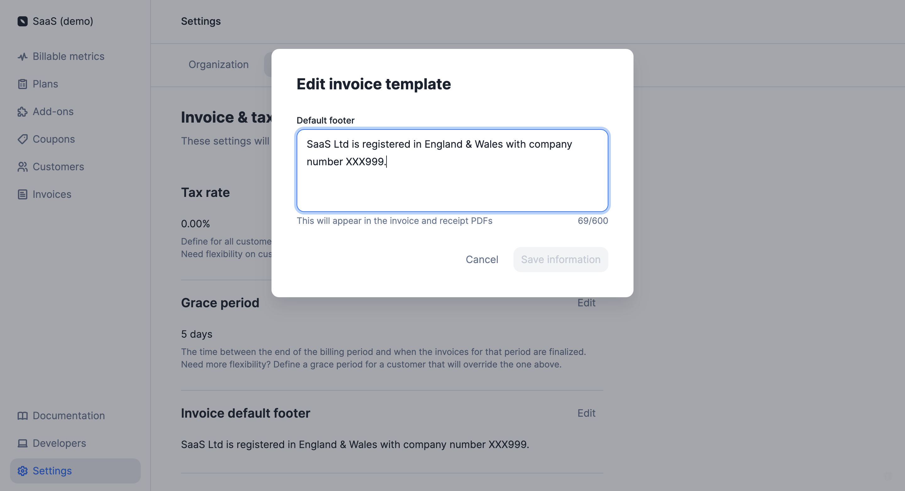

# Download invoices
When a new invoice is `finalized`, Lago will automatically send a [webhook](../../api/webhooks/messages) to notify you. It will also generate a PDF file that you can download and send to your customer.

To download an invoice through the user interface:
1. Click **"Customers"** in the side menu;
2. Select a customer from the list;
3. Open the **"Invoices"** tab;
4. Click the **ellipsis icon** on the right of the invoice; and
5. Click **"Download invoice"** to open the file in a new tab.

You can also download invoices via API ([learn more](../../api/invoices/download-invoice)).

## How to modify the invoice template
You can modify some of the elements that are included in the PDF invoice, such as information about the organization, its logo and the footer.

To update your organization's information and logo:
1. Click **"Settings"** in the side menu;
2. In the **"Organization"** tab, click **"Edit"** in the **"Information"** block;
3. Choose a file to update the logo and fill out the form to update your organization's information; and
4. Click **"Save information"** to confirm.

:::info
For the logo, you can upload a JPG or PNG file with a maximum size of 800 KB.
:::

To update the footer of the invoice:
1. Click **"Settings"** in the side menu;
2. Open the **"Invoice"** tab;
3. Select **"Edit"** in the **"Invoice default footer"** block;
4. Enter your text (maximum 600 characters); and
5. Click **"Save information"** to confirm.

:::info
Changes to the invoice template and new information about your organization do not affect existing invoices and only apply to future invoices.
:::