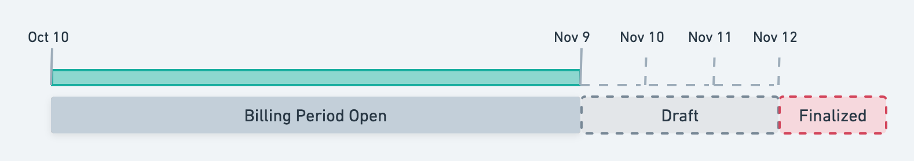
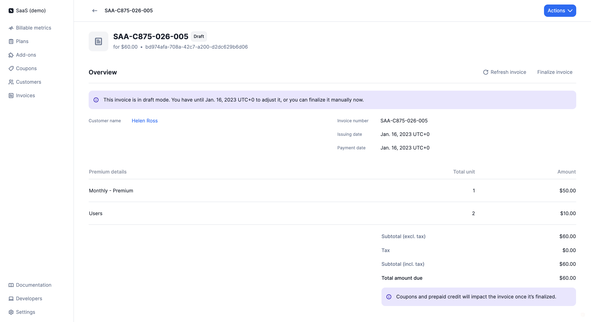
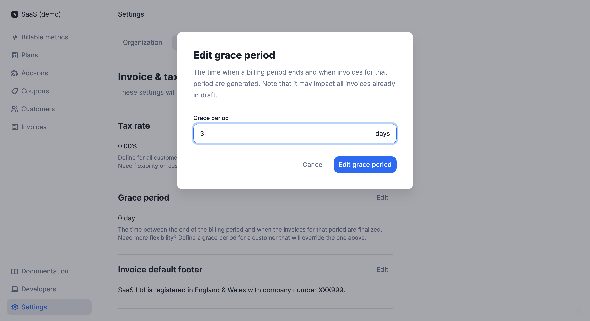
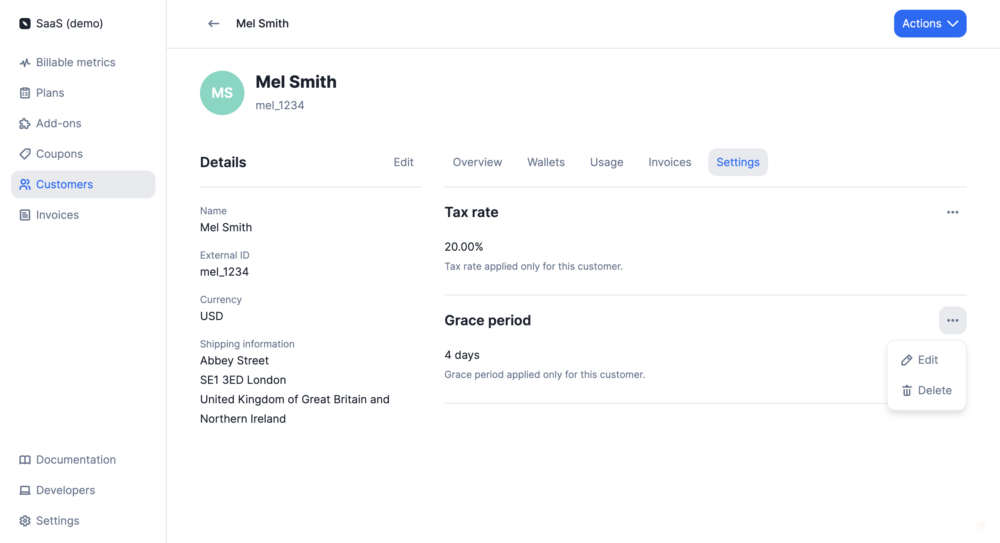

# Grace period
:::note Premium feature ✨
This feature is only available to users with a premium license. Please **[contact us](mailto:hello@getlago.com)** to get access to Lago Cloud and Lago Self-Hosted Premium.
:::

A grace period is defined as a number days during which invoices remain in `draft` status, allowing you to review them and make changes before they are `finalized` and sent for payment collection.

In the example below, the timeline includes a billing period of one month and a grace period of three days.

## Application scope and possible actions
The grace period applies to **subscription invoices**. It does not apply to invoices related to add-ons (i.e. one-off invoices) or credit purchases.

The creation of a `draft` invoice triggers the `invoice.drafted` [webhook](../../api/webhooks/messages).

When a subscription invoice is in `draft` status, you can:
- **Add usage records** by sending events with a `timestamp` within the relevant billing period;
- **Apply coupons** to the customer's account; and
- **Add credits** to the customer's wallet and credit note wallet.

In order to add usage to an invoice that is in `draft` status, the `timestamp` of the [events](../events/ingesting_events#send-usage-measurements-to-lago) must be within the billing period. Consider the following example:

>The billing period started on January 1st and ended on January 31st. We have defined a 3-day grace period and today is February 2nd.
>
>On February 1st, Lago automatically generated a `draft` invoice for the period January 1st to January 31st.
>
>We want to send additional usage records for this invoice. To do so, the timestamp of our events must be included in the period January 1st to January 31st.
>
>`1673457300` (i.e. January 11th, 2023) is a valid timestamp, therefore the event will be included in the `draft` invoice.
>
>However, `1675354500` (i.e. February 2nd, 2023) is outside the billing period under consideration, therefore the event will not be included in the `draft` invoice, it will be included in the next invoice.

After sending events, you can **go to the invoice list and refresh** the corresponding `draft` invoice to ensure your new events have been taken into account.

When all changes have been made, you can either wait for the grace period to expire (the invoice status will automatically switch to `finalized`) or you can **finalize the invoice manually** through the user interface or the API.

When an invoice is `finalized`, it can no longer be edited. Finalizing an invoice triggers the `invoice.created` webhook.

:::info
Coupons and credits that are applied/added during the grace period will not appear on `draft` invoices but will be automatically deducted from the customer's next `finalized` invoice.
:::

## Define a grace period at organization level
The organization's grace period applies to all customers by default.

To define a grace period at organization level through the user interface:
1. Access the **"Settings"** section via the side menu;
2. Open the **"Invoice"** tab;
3. Click **"Edit"** in the **"Grace period"** block;
4. Enter the number of days associated with the grace period; and
5. Click **"Edit grace period"** to confirm.

You can modify the organization's grace period at any time through the user interface or [the API](../../api/organizations/update-organization).

:::caution
If you shorten the organization's grace period, some invoices in `draft` status may be automatically `finalized`. For instance, if the initial grace period was five days, but then three days into the grace period you decide to reduce it to two days, then all `draft` invoices will automatically switch to `finalized`.
:::

## Define a grace period at customer level
The customer's grace period overrides the organization's grace period. It only applies to the customer with whom it is associated.

To define a grace period at customer level through the user interface:
1. Access the **"Customers"** section via the side menu;
2. Select a customer from the list;
3. Open the **"Settings"** tab of the customer view;
4. Click **"Add grace period"** in the **"Grace period"** block;
5. Enter the number of days associated with the grace period; and
6. Click **"Add grace period"** to confirm.

You can modify the customer's grace period at any time through the user interface or [the API](../../api/customers/update-customer).

:::caution
If you shorten the customer's grace period, some invoices in `draft` status may be automatically `finalized`. For instance, if the initial grace period was five days, but then three days into the grace period you decide to reduce it to two days, then all `draft` invoices will automatically switch to `finalized`.
:::