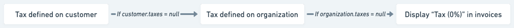

# Taxes
A tax object represents various types of taxes that an organization may incur. These taxes can be applied at both the organization level and the customer level.

## Create taxes
To add a new tax through the user interface:
1. Access to the taxes settings page through the Settings page > Taxes tab
2. In the upper right corner of the list, click **“Add”** to create a new tax;
3. Enter its `name`;
4. Assign it a unique `code` (i.e. unique ID as defined in your backend system)
5. Add a `description` *(optional)*;
6. Define the `rate` that applies to invoices.

## Editing and deleting taxes
A tax can be deleted or edited even if it is linked to an organization or a customer. However, it's important to note that any changes made to a tax, including its removal, will have an impact on all existing draft invoices or upcoming invoices that are associated with that tax.

1. **Edit**: allows you to modify the name, code and the rate of the tax;
2. **Delete**: allows you to delete the tax and remove it from the list (this action cannot be undone).

## Apply taxes on objects
When generating invoices, you may need to apply taxes. The tax rate applies to all fees (i.e. subscription fees and charges) and appears on the invoices.

### Taxes on the organization
To apply tax objects on the organization through the user interface:
1. Access to the invoice settings page through the Settings page > **Invoice** tab
2. In the Taxes on organization section, click **“Add”** to add a new tax
3. Select the tax object you want to apply in the dialog
4. Repeat the action if you want to add more than 1 tax

### Taxes on a specific customer
To apply tax objects on a specific customer through the user interface:
1. Access to customer taxes settings page through the **Customer** details page > **Settings** tab
2. In the Tax rates section, click **“Add a tax”** to add a new tax
3. Select the tax object you want to apply in the dialog
4. Repeat the action if you want to add more than 1 tax

### Hierarchy between objects on invoice generation
When taxes are applied at the organization level, it is crucial to note that any customers without specific tax settings will inherit the defined taxes. This means that the tax settings defined for the organization will be automatically applied to those customers who do not have their own individual tax configurations.

**Taxes hierarchy when generating an invoice:**
1. Apply taxes defined at the customer level on invoice; if customer’s taxes are empty
2. Apply taxes defined at the organization level on invoice; if organization’s taxes are empty
3. Apply a tax at 0% and display “Tax (0%) on invoice.

