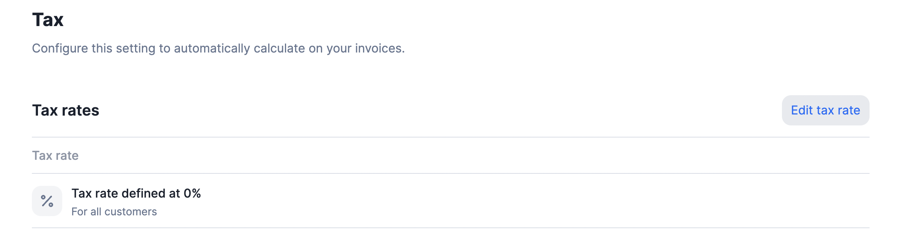

# Taxes
When generating invoices, you may need to apply taxes. The tax rate applies to all fees (i.e. subscription fees and charges) and appears on the invoices.

## General tax rate
There is a default tax rate at the organization level that applies to all customers and is 0%.

To modify the default tax rate for the organization:
1. Click **"Settings"** in the side menu;
2. Open the **"Invoice & tax"** tab;
3. Select **"Edit tax rate"** on the right;
4. Enter the desired tax rate; and
5. Click **"Edit tax rate"** to confirm.



## Customer-specific tax rate
If you need to define a specific tax rate for a customer, you can override the organization's tax rate by defining a tax rate at customer level.

To define a customer-specific tax rate through the user interface:
1. Click **"Customers"** in the side menu;
2. Select a customer from the list;
3. Open the **"Tax rate"** tab;
4. Click **"Add a tax rate"** on the right;
5. Enter the desired tax rate; and
6. Click **"Add tax rate"** to confirm.

If later you want to edit or delete the customer's tax rate, click the **ellipsis icon** to see all available actions.

You can also use the following endpoint to add or edit the customer's tax rate via API:

```curl title="POST"
/api/v1/customers
```

To do so, you must include the `vat_rate` argument in the body of the request.