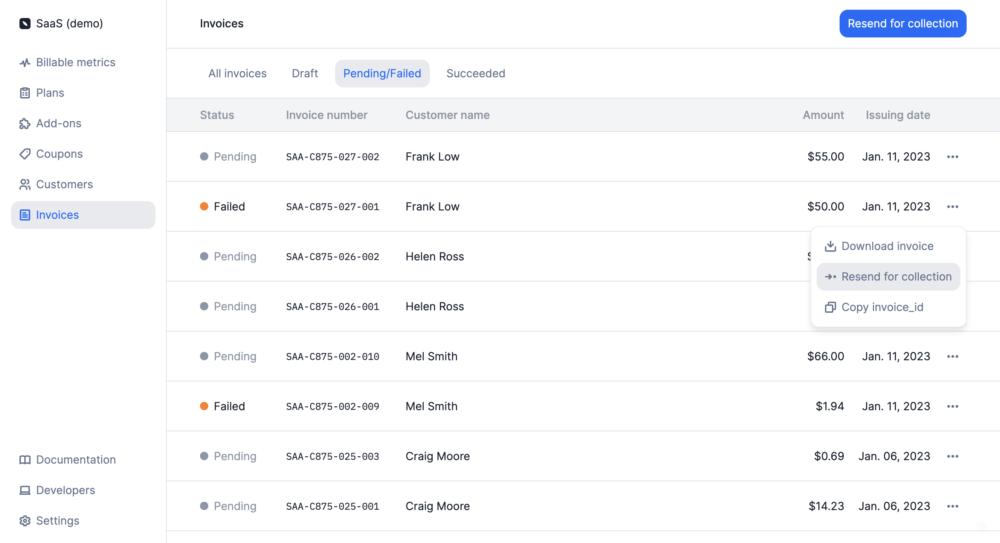

# Payment retries
Whether you use one of our native integrations or rely on our [webhooks](../../api/webhooks/messages) to collect payments, you have the ability to manually resend payments for collection when needed.

To re-trigger the payment process through the user interface:
1. Access the **"Invoices"** section via the side menu;
2. Open the **"Pending/Failed"** tab;
3. Find the invoice for which you would like to collect payment;
4. Click the **ellipsis icon** on the right; and
5. Select **"Resend for collection"**.

In the **"Pending/Failed"** tab of the **"Invoices"** section, you can also click **"Resend for collection"** in the upper right corner to re-trigger the payment process for all invoices in the list.

When a payment is resent for collection, an `invoice.created` or `invoice.add_on_added` webhook is automatically sent, depending on the type of invoice.

In addition to this, if the default payment provider for the customer is [Stripe](stripe-integration) or [GoCardless](gocardless-integration), Lago will automatically process the payment through integration.

It is also possible to trigger payment retries via the API ([learn more](../../api/invoices/retry-payment)).