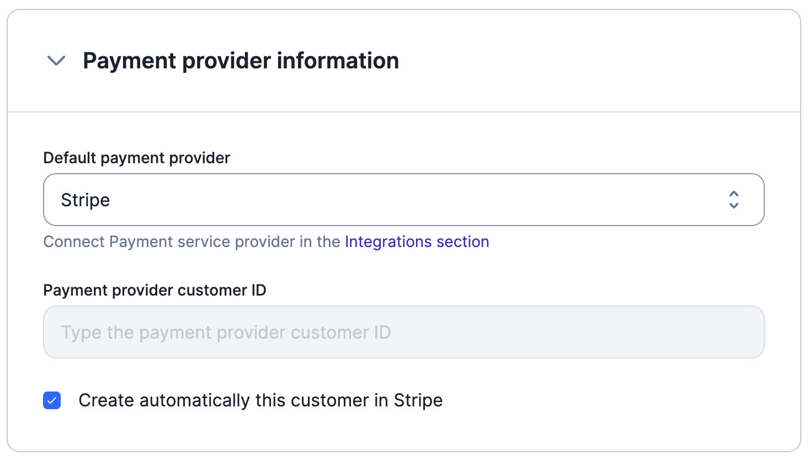
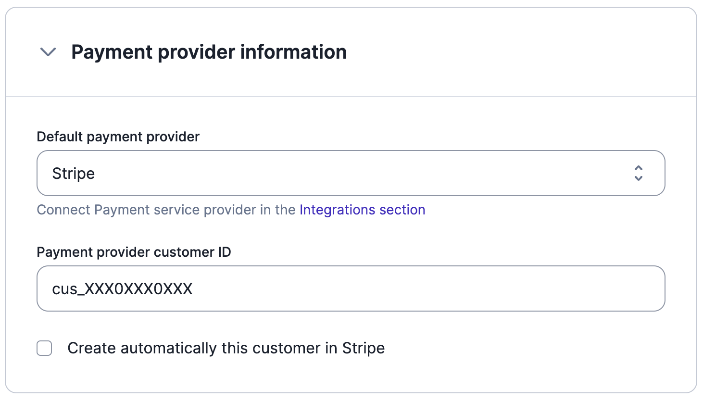

# Stripe Integration
Lago's native integration with Stripe allows you to collect payments automatically when new invoices are generated.

## Integration setup
To set up the integration with Stripe through the user interface:
1. In the side menu, select **"Settings"**;
2. Select the **"Integrations"** tab;
3. Click **"Stripe"** and enter your Stripe API key ([locate your API key](https://support.stripe.com/questions/locate-api-keys-in-the-dashboard)); and
4. Click **"Connect to Stripe"** to confirm.

:::info
By default, customers created in Lago are not automatically created in Stripe. If you want your Lago customers to be added to Stripe, you need to activate this option ([learn more](#new-customer)).
:::

## Customer information
To collect payments automatically, the customer must exist in both the Lago and Stripe databases.

### New customer
If the customer does not already exist in Stripe, you can first create them in Lago, either via the user interface or [the API](../../api/customers/create-update-customer). When adding customer information, you must:
1. Define Stripe as the **default payment provider**;
2. Leave the field associated with the **Stripe customer ID** blank; and
3. **Enable** the option to automatically create the customer in Stripe.

The customer will automatically be added to Stripe. Stripe will then return the customer ID, which will be stored in Lago.

### Existing customer
If the customer already exists in Stripe but not in Lago, you should create the customer record, either via the user interface or [the API](../../api/customers/create-update-customer). When adding customer information, you must:
1. Define Stripe as the **default payment provider**;
2. Provide the **Stripe customer ID**; and
3. **Disable** the option to automatically create the customer in Stripe.

## Payment intents
Once Stripe is connected and the customer exists in both databases, you can start collecting payments.

Each time a new invoice with an **amount greater than zero** is generated by Lago, a payment intent will automatically be created. Stripe will record the invoice ID and process the payment. If the payment is successful, the status of the payment will switch from `pending` to `succeeded`.

If the payment fails, the status of the payment will switch from `pending` to `failed` and Lago will generate an `invoice.payment_failure` [webhook](../../api/webhooks/messages).

:::caution
A valid payment method for the customer must be defined in Stripe for the payment intent to succeed ([learn how to save payment details](https://stripe.com/docs/payments/save-and-reuse)).
:::
