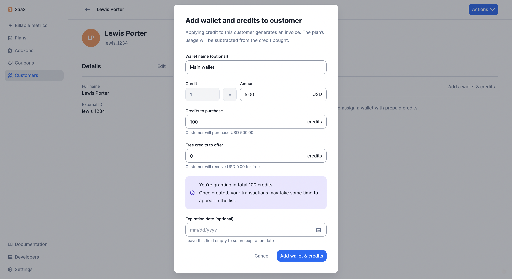

# Prepaid Credits
Since usage-based charges are calculated at the end of the billing period, you often need to wait to collect payments. With prepaid credits, you can now unlock recurring revenue opportunities for pay-as-you-go pricing models.

Prepaid credits increase predictability as they allow you to collect payments in advance and then monitor the evolution of the balance of your customer's wallets.

## Create wallets
:::caution
The customer must have an **active subscription** in order to have a wallet.
:::

To create a wallet for one of your customers through the user interface:
1. Access the **"Customers"** section via the side menu;
2. Select a customer from the list;
3. Open the **"Wallets"** and click **"Add a wallet & credits"** on the right;
4. Choose a name for the wallet (optional);
5. Set the credit value (e.g. 1 credit = $5);
6. Enter the number of credits to be purchased and/or granted for free;
7. Set the [expiration date](#expiration-date-and-termination) (optional); and
8. Click **"Add wallet & credits"** to confirm.

Free credits are added to the customer's wallet instantly, while purchased credits are added to the wallet when payment is confirmed (see below).

Each customer can only have one active wallet.

## Credit purchases and top-ups
Lago automatically generates an invoice for each purchase and taxes apply. Payment must be made in order for credits to be added to the customer's wallet (i.e. the status of the invoice must be `succeeded`).

To top up a wallet through the user interface:
1. Open the **"Wallets"** tab and click **"Edit wallet"** on the right;
2. Select **"Top up credit"**;
3. Enter the number of credits to be purchased and/or granted for free; and
4. Click **"Top up credit"** to confirm.

:::info
Coupons **do not apply** to credit purchases and top-ups.
:::

## Application scope
Prepaid credits are deducted from the subtotal of the next invoice(s), before tax.

:::info
Prepaid credits **do not apply** to invoices related to add-ons.
:::

## Expiration date and termination
By default, if you don't set an expiration date, prepaid credits are carried over to the next billing period until the wallet balance is zero.

If you define an expiration date, when the date is reached, all remaining credits are **automatically voided**.

To modify the expiration date of the prepaid credits through the user interface:
1. Open the **"Wallets"** tab and click **"Edit wallet"** on the right;
2. Select **"Edit information"**;
3. Modify the expiration date; and
4. Click **"Edit information"** to confirm.

You also have the ability to terminate a wallet manually, before its expiration date:
1. Open the **"Wallets"** tab and click **"Edit wallet"** on the right;
2. Select **"Terminate wallet"**; and
3. Click again to confirm.

:::caution
Terminating a wallet will instantly void all remaining credits. This action **cannot be undone**.
:::