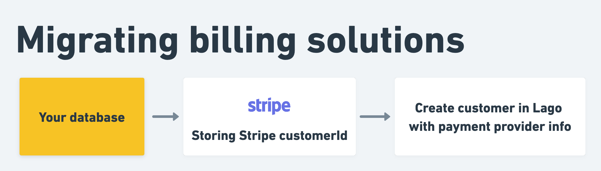

# Stripe Integration
Lago's native integration with Stripe allows you to collect payments automatically when new invoices are generated.

## Setting up the integration
To set up the integration with Stripe through the user interface:
1. In the side menu, select **"Settings"**;
2. Select the **"Integrations"** tab;
3. Click **"Stripe"** and enter your Stripe API key ([locate your API key](https://support.stripe.com/questions/locate-api-keys-in-the-dashboard)); and
4. Click **"Connect to Stripe"** to confirm.

:::info
By default, customers created in Lago are not automatically created in Stripe. If you want your Lago customers to be added to Stripe, you need to activate this option manually.
:::

## Customer information
To collect payments automatically, the customer must exist in both the Lago and Stripe databases.

If the customer already exists in Stripe but not in Lago, we recommend that you use the Lago API to [create the customer record](../api/customers/create-update-customer). When adding customer information, you must:
1. Define Stripe as the **default payment provider**; and
2. Provide the **Stripe customer ID**.

If the customer does not exist in Stripe, you can first create them in Lago and if the option to create Lago customers in Stripe is activated, the customer will automatically be added to Stripe. Stripe will then return the customer ID, which will be stored in Lago.

## Payment intents
Once Stripe is connected and the customer exists in both databases, you can start collecting payments.

Each time a new invoice **with an amount greater than 0 (zero)** is generated by Lago, a payment intent will automatically be created. Stripe will record the invoice ID and process the payment. If the payment is successful, the status of the invoice will switch from `pending` to `succeeded`.

If the payment fails, the status of the invoice will switch from `pending` to `failed` and Lago will generate an `invoice.payment_failure` webhook ([learn more](../api/webhooks/messages)).

:::caution
A valid payment method for the customer must be defined in Stripe for the payment intent to succeed ([learn how to save payment details](https://stripe.com/docs/payments/save-and-reuse)).
:::

## Implementation options
The level of development of your billing and payment system will determine the optimal setup for the Lago-Stripe integration.

### New billing and payment system
When implementing a new system:
1. Set up the Lago-Stripe integration and **activate** the option that automatically creates Lago customers in Stripe;
2. When a customer signs up to your application, use the API to create the corresponding customer record in Lago;
3. Lago will automatically create the customer in Stripe and retrieve the Stripe customer ID;
4. When the customer adds their payment details via the checkout page of your application, use the Stripe API to update their payment method; and
5. You're ready to start billing!

### Migration to a new billing system
When migrating to a new system:
1. Set up the Lago-Stripe integration and **deactivate** the option that automatically creates Lago customers in Stripe;
2. Use the customer information that is already in your application database to create customers in Lago, including their Stripe customer ID;
3. Make sure there's a valid payment method defined for each customer in Stripe; and
4. You're ready to start billing!

