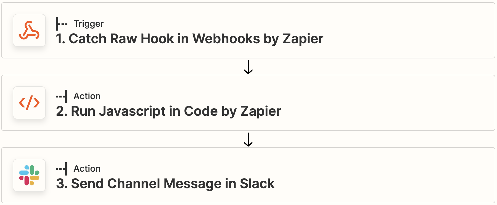
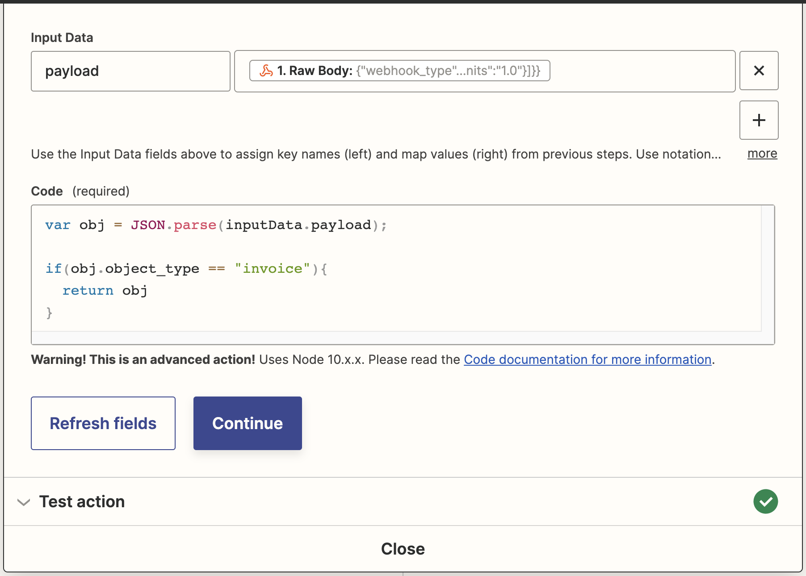
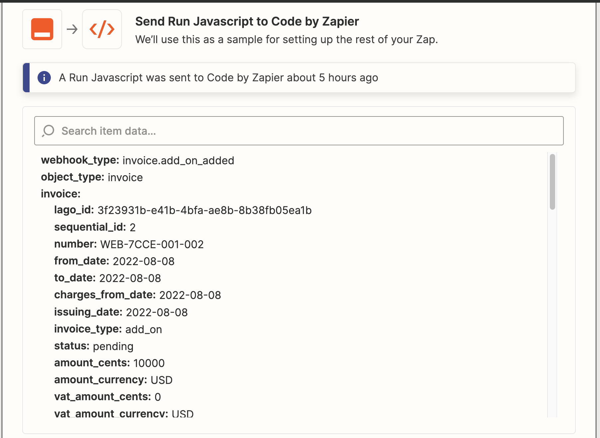
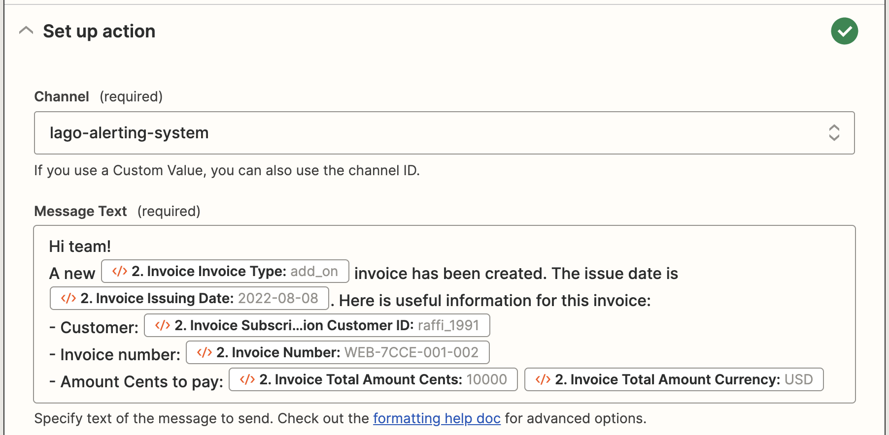

# Invoice Alerting Example (with Zapier)


In this example, we are going to **build an alert anytime a new invoice is emitted**. To create this workflow, we are using:
1. Lago's webhook when a new invoice is emitted;
2. Zapier as an automation tool, to catch, tranform and send the data; and
3. Slack as the "receiver" to alert your team anytime a new invoice is created.



## 1. Catch a webhook when a new invoice is emitted
Lago automatically creates an invoice when a billable period is over. The invoice's payload gives you a detailed view of what has been invoiced. The first action we need to perform is to catch this invoice with a webhook:

1. In Zapier, create a new Zap;
2. Use the **Webhooks by Zapier** as the trigger of this Zap;
3. Select the **Catch Raw Hook** event trigger;
4. Copy the Zapier Webhook URL and paste it in Lago (**Developers** > **Webhooks** > **Add a webhook**); and
5. Catch your first webhook when an invoice is emitted (whenever you assign an add-on or a subscription).


## 2. Run a script to transform the webhook
In Zapier, create a second action by clicking the `+` icon. This new event action is used to format the webhook with a breakdown of fields that can be used in a message.

1. Select **Code by Zapier** as a new *Event Action*;
2. Click on **Javascript** as the event code language to run;
3. Create a field called `payload`. The value of this field is the full **Raw body** of your invoice object received);
4. Run the script (code snippet below) in the **Code** section;
5. Test the action. If valid, it returns a breakdown of fields.

```javascript
var obj = JSON.parse(inputData.payload);

if(obj.object_type == "invoice"){
  return obj
}
```




## 3. Send a message to a Slack Channel
Once you catch the breakdown of fields returned by the invoice payload, you can easily use them to create a Slack text message.

In Zapier, create a third action by clicking the `+` icon. This new event action is used to send a message to Slack by using the fields of the invoice payload.

1. Select **Slack** as a new app action;
2. Select the **Send Channel Message** action;
3. Choose the targeted **Slack Account**;
4. Choose the targeted **Slack Channel**; and
5. Create a message by using the fields returned by the payload.

By testing and validating the entire Zap, a Slack message is sent anytime a new invoice is emitted by Lago. You can use the same message example as detailed below:


