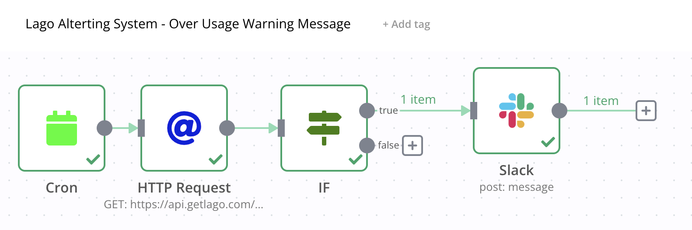
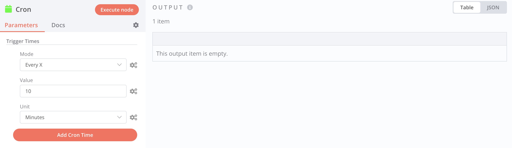
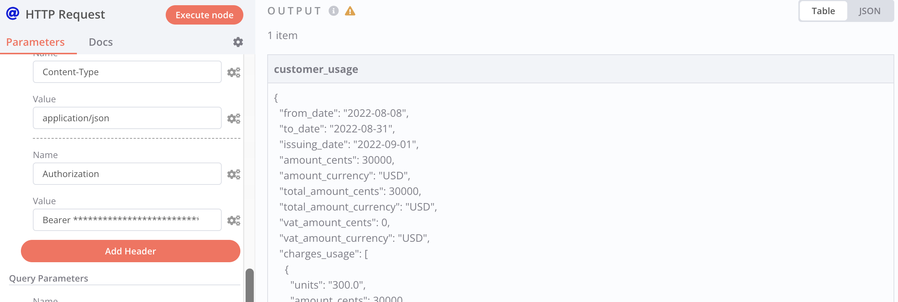
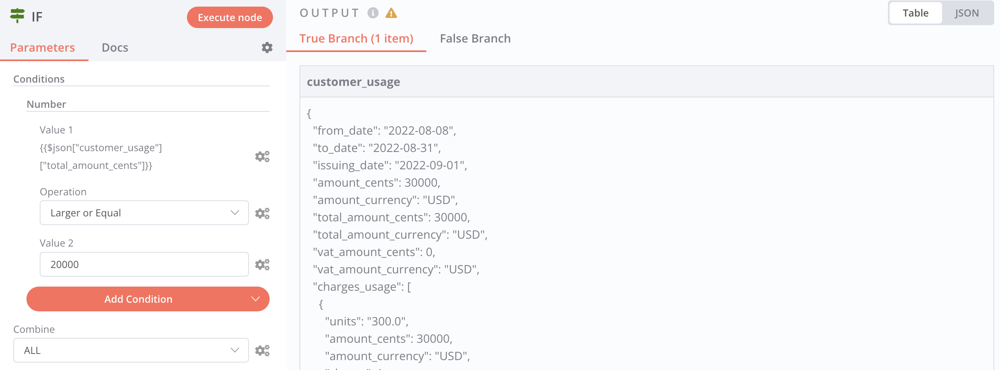
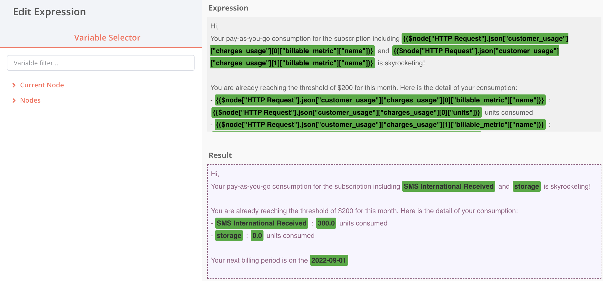
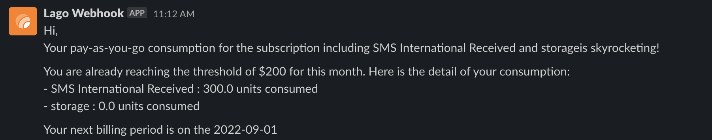

# Overconsumption Alerting Example (with N8N)

When one of your customers is overconsuming during a period, you might need to warn her. This might happen for Cloud or API products. Automatic billing does not mean that your customers should have a bad surprise when opening their invoices.

Here is a full workflow to create an alerting system based on your customers' current usage, using [N8N](https://n8n.io/), a powerful automation tool for developers.

In this example, we are going to build an alert anytime a usage threshold is overcome. Here is a summary of this workflow:
1. Use a **Cron** expression to call the Lago API every X minutes/hours/days
2. Call the [**Current usage**](../../api/customer_usage/customer-usage) endpoint available in Lago to fetch your customers' current usage;
3. Create a **IF statement** to condition the trigger (in our case, messages are triggered above a specific overconsumption); and
4. **Send a message** whenever this threshold is reached. You could use an emailing tool, Slack or a CRM. In our case, we are using Slack.

## 1st Node - CRON expression to repeat tasks at a defined interval
The first node is repeatedly and automatically triggering the automation at a defined interval.
1. Add a new **Node**;
2. Select **CRON** as a new application node;
3. The **Mode** is set to `Every X`; and
4. The **Value** is defined to `10` and the the **Units** to `minutes`. 

This will trigger the flow automatically every 10 minutes. You can obviously change the value and the units to your preferred interval.

## 2nd Node - Catch customers' current usage with a HTTP Request
This node is used to fetch current usage from Lago API, using a HTTP request.
1. Add a new **Node**;
2. Select **HTTP Request** as a new application node;
3. Fetch [customers' current usage](../../api/customer_usage/customer-usage) from Lago API;
4. Make sure to set the `API_KEY` and the `Content-Type` as headers of your request; and
5. Execute the node to fetch the payload from Lago's API.

## 3rd Node - IF conditional statement to trigger messages under conditions
This node is used to trigger the alert only when your customers overcome a threshold of usage. Those limits depend on your product and your paying features.

In our present use case, we want to trigger an alert **when the total consumption of usage-based features overcomes $200**. You could also use the `number of units` consumed or another useful value from the payload.

1. Add a new **Node**;
2. Select **IF** as a new application node;
3. Create a condition for the **TRUE** branch (when conditions are met);
4. The **Value** is the parameter of your condition (in our case the `amount_cents` of the current usage);
5. The **Operation** is the math operation you want to apply (in our case, condition is met when the total `amount_cents` is larger or equal to $200);

It is important to mention that:
- You can add as many conditions as you need;
- You could add an action when the condition is `FALSE`.

## 4th Node - Send an alert message to Slack
This last node is used to trigger the message. In the example, we use a Slack channel, but you could even decide to send an email directly to your customers when they pass the limits of usage.

1. Add a new **Node**;
2. Select **Slack** as a new application node;
3. Select the targeted **Slack Account** & **Slack Channel**;
4. Choose the option to **POST** a **Message**; and
5. **Define a message** and use the variables of your payload to give context to your customers about their current usage.

:::tip
On top of connecting your Slack account, don't forget to authorize the application's bot to post messages to the targeted channel.
:::

