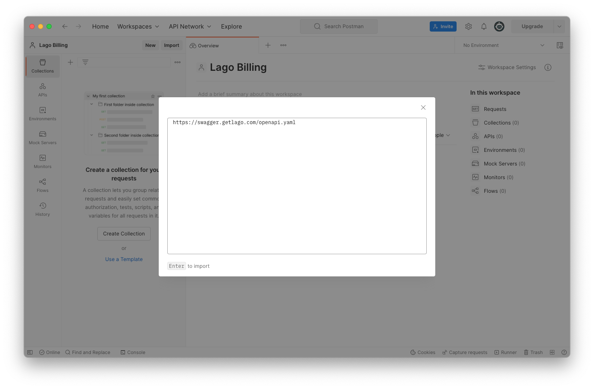

# Lago Open API
Using our Open API is a great way to explore and interact with Lago API documentation.

## Prerequisites
Before you start, here are the important prerequisites or useful links Lago provides to start using its Open API.

1. Create a free [Postman](https://postman.com) account;
2. Use the [Swagger](http://swagger.getlago.com/) for Lago API Documentation;
3. Open a Lago account, as you need to have your own API Key; and
4. Take a look at our open-sourced [Github repository](https://github.com/getlago/lago-openapi) for the Open API.

## Using Lago Open API with Postman
The swagger used to document Lago's API can be imported directly into Postman: 

1. **Copy the following link:** http://swagger.getlago.com/swagger.yaml (this link can also be found in the Swagger's page);
2. In Postman, under **Import > Link**, paste the url mentionned in the previous point;
3. Click on **Continue**; and
4. Click on the final **Import** button; and
5. In the menu, under **API**, find the newly created **Lago API documentation**.

The import will take a few seconds to be completed. You can then use this new API to generate a new collection. Don't forget to use the API Key of your own Lago's organization.

