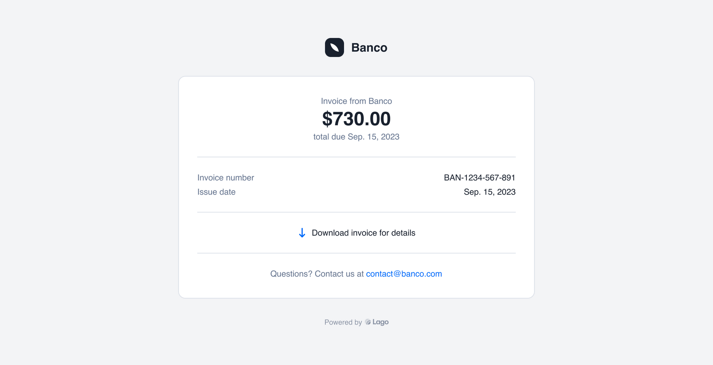

# Emails
:::note Premium feature ✨
Only users with a premium license can automatically send emails from Lago to their customers. Please **[contact us](mailto:hello@getlago.com)** to get access to Lago Cloud and Lago Self-Hosted Premium.
:::

With Lago, sending invoices and credit notes to your customers is simple - you can automatically email them as soon as they are created.

:::caution
Lago will never ask for payment details or personal information.
:::

## SMTP setup on Lago Cloud
You don't have to worry about SMTP settings with Lago, we take care of it, so you can sit back and relax.

## SMTP setup on Lago Self-hosted Premium
In order to use the email feature, please configure your environment variables [as described here](./self-hosting/docker#smtp-configuration).

## Prerequisites for sending emails
To send emails to your customers, you will need to:

1. Define an organization email in Settings > Organization;
2. Optionally, add your organization’s logo in Settings > Organization;
3. Turn on the relevant email scenarios; and
4. Define the customer’s email address during customer creation/edition.

## Email scenarios
Lago sends emails to your customers for two scenarios: when an invoice is created (i.e. for add-ons, subscriptions and prepaid credit purchases), and when a credit note is issued for a customer.

By default, both scenarios are switched off. You can turn on/off these scenarios by:

1. Going to Settings;
2. Selecting Emails;
3. Toggling each scenario on/off; or
4. Clicking on a scenario to view the corresponding email; and
5. Using the toggle in the upper-right corner to switch on/off the scenario.

## Email locale
The email will be sent to customers based on the organization or customer’s document locale. This means that the email will have the same locale as the invoice sent.

## Email sending address
For the cloud version, Lago uses no-reply@getlago.com as the sending email address. This email address cannot receive replies from your customers. However, your organization’s email address will be included in the email template in case your customer needs to contact you (see below).

## Email template

As mentioned above, some information in the email template can be customized based on the settings of your account, including:

1. The logo of your organization;
2. The name of your organization; and
3. The email address of your organization.