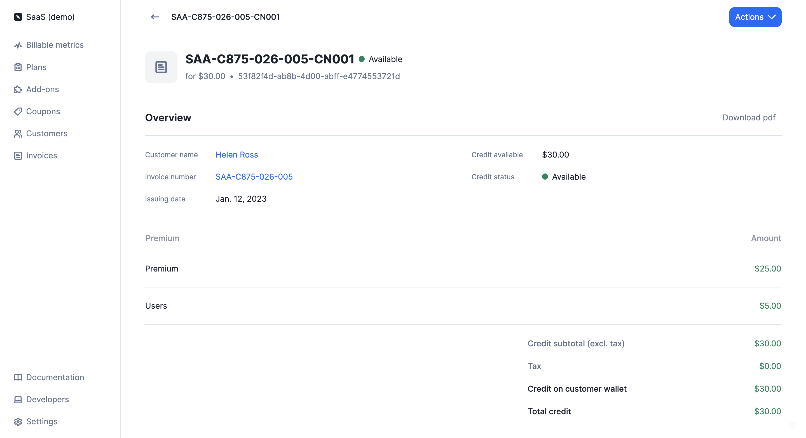

# Credit Notes
You can issue a credit note to refund or credit back a customer's account. Credit notes can be issued for invoices related to subscriptions and add-ons, but not for invoices related to credit purchases.

:::info
Credit notes can only be issued for invoices with the status `finalized` and an amount greater than zero.
:::

## Create credit notes
To create a credit note through the user interface:
1. Go to the **"Customers"** section;
2. Select a customer to open the customer view;
3. Open the **"Invoices"** tab;
4. Click an invoice to see its details; and
5. Select **"Issue a credit note"** from the **"Actions"** dropdown (upper right corner).

The credit note creation process varies depending on the payment status of the invoice:
- If the payment status of the invoice is `pending` or `failed`, the credit note will allow you to credit back the customer's account; and
- If the payment status of the invoice is `succeeded`, the credit note will allow you to credit back the customer's account and/or refund them.

:::info
Coupons and prepaid credits cannot be refunded, they can only be credited back to the customer's account.
:::

To issue a credit note:
1. Select a reason from the list (e.g. duplicate charge, order cancelation, etc.);
2. Add an internal note (optional);
3. Select the item(s) and enter the amount(s) you want to credit;
4. Select the credit method(s) (only available for paid invoices - [learn more](#credit-methods)); and
5. Click **"Issue credit note"** to confirm.

:::info
For each item, you must enter a credit amount equal to or less than the initial amount of the item, excluding tax. The total amount of the credit note cannot exceed the total amount of the invoice.
:::

When the credit note is created, it will appear below the original invoice on the invoice details page and in the **"Credit notes"** tab of the customer view. In addition to this, a `credit_note.created` [webhook](../api/webhooks/messages) will automatically be sent by Lago.

You can link several credit notes to an invoice. Like invoices, credit notes have a unique number and can be downloaded in PDF format.



## Credit methods
### Refund
When a credit note involves a refund, the amount of the refund will be included in the `credit_note.created` [webhook](../api/webhooks/messages), which will allow you to proceed with the payment.

The credit note will also feature a `refund_status` that can be `pending`, `succeeded` or `failed`. You can update the status of the refund via the API.

:::tip
If you use one of our native payment integrations, the refund process will automatically be triggered by Lago.
:::

### Credit note wallet
The amount of the credit note that is not refunded is credited to the customer's account via a credit note wallet. The credit amount is included in the `credit_note.created` [webhook](../api/webhooks/messages) and displayed on the credit note details page.

:::info
A credit note wallet is linked to a single credit note and therefore, to a single invoice. If there are several credit notes linked to the customer's account, Lago will create a credit note wallet for each of them.

Credit note wallets are different from wallets associated with [prepaid credits](prepaid_credits).
:::

The total amount available in the credit note wallets will be deducted from the subtotal of the customer's next invoice(s), after tax (see below).

```
EXAMPLE OF INVOICE
-----------------------------
All subscriptions = $50
All usage-based fees = $20
-----------------------------
Subtotal (excl. tax) = $70
Tax (10%) = $7
-----------------------------
Subtotal (incl. tax) = $77
Credit notes = $20
Coupons = $10
Prepaid credits = $30
-----------------------------
Total due = $17
```

When the credit note wallet is created, the initial `credit_status` is `available`. Then when the amount of the credit note wallet is zero, the status switches to `consumed`.

You can also void a credit note wallet. To do so:
1. Go to the **"Customers"** section;
2. Select a customer to open the customer view;
3. Open the **"Credit notes"** tab;
4. Click a credit note to see its details; and
5. Select **"Void credit available"** from the **"Actions"** dropdown (upper right corner).

:::caution
When voiding a credit note wallet, the remaining credit amount will be lost and the `credit_status` will switch to `voided`. This action cannot be canceled.
:::