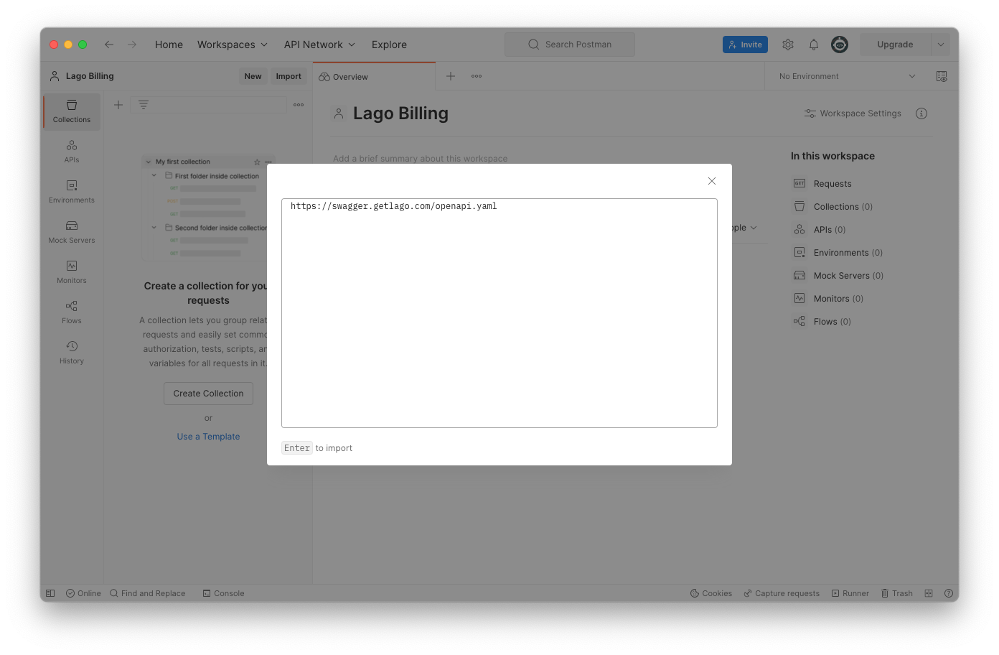

# Lago Open API
Using our Open API is a great way to explore and interact with Lago's API documentation.

## Prerequisites
Before you start using our Open API, here are some important prerequisites and useful links:

1. Create a free [Postman](https://postman.com) account;
2. Use the [Swagger UI](http://swagger.getlago.com/) for Lago's API documentation;
3. Open a Lago account to get your API key; and
4. Check out our public [GitHub repository](https://github.com/getlago/lago-openapi).

## Using Lago Open API with Postman
The Swagger used to document Lago's API can be imported directly into Postman. To do so: 

1. **Copy the following link:** http://swagger.getlago.com/openapi.yaml (this link can also be found on the Swagger UI's page);
2. In Postman, under **Import > Link**, paste the URL above;
3. Click **Continue**;
4. Click the **Import** button; and
5. In the menu, under **API**, find the newly created **Lago API documentation**.

It only takes a few seconds to complete the import. You can then use this API to generate a new collection.

Please don't forget to enter the API key associated with your organization's Lago account to authenticate your API requests.

