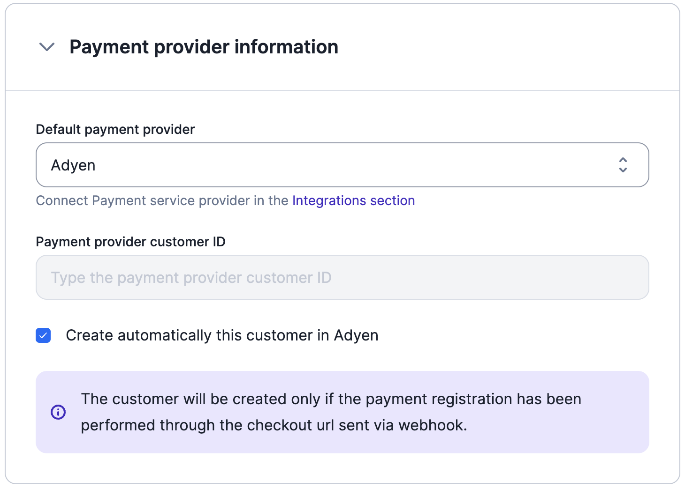
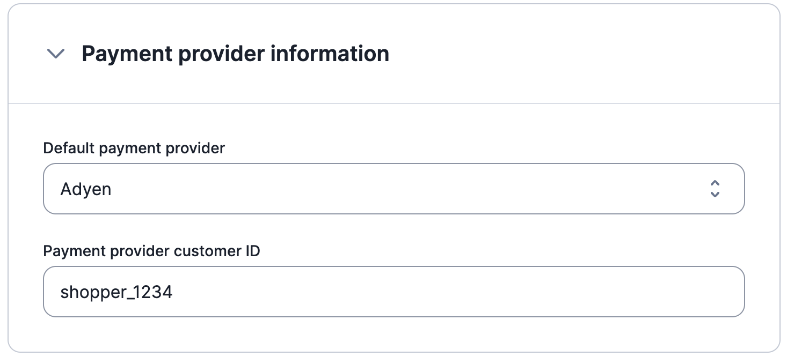
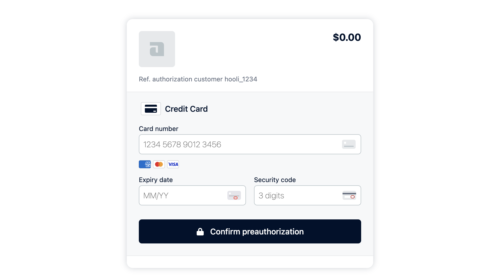

# Adyen
Lago's seamless integration with Adyen offers a wide range of payment options, enabling you to conveniently collect payments from your customers. Supported payment methods include:

- Card payments (Visa, MasterCard, CB)
- Apple Pay
- Paypal
- American Express
- Amazon Pay
- Google Pay

And many more! With Lago's native Adyen integration, you can offer your customers a variety of payment options, enhancing their convenience and flexibility during transactions.

## Connecting Lago to Adyen
To set up the Adyen integration in Lago from our user interface, follow these steps:

1. In the side menu of your Lago app, navigate to **Settings**;
2. Select the **Integrations** tab;
3. Click on **Adyen** and enter the required connection fields (described in the next section); and
4. Click **Connect to Adyen** to confirm the integration.

## Adyen Connection Fields
When connecting Lago to Adyen, you need to provide information for the following fields.

### 1. API Key (mandatory)
The API Key is a mandatory field and can be found in your Adyen account. Follow these steps to retrieve the API Key:

- Go to your Adyen account and navigate to **Developers** > **API Credentials**;
- On the API Credentials page, create new credentials with a type of **Web service user**;
- Click on the **Create credentials** button to generate the API Key; and
- Copy the API Key and paste it in the corresponding field in Lago. Remember to save the changes.

### 2. Merchant Account (mandatory)
The Merchant Account is required to ensure that Lago targets the correct Adyen account. To find the Merchant Account:

- Go to **Settings** > **Merchant accounts** in your Adyen account; and
- Copy the **Account code** of the targeted account you want to use with Lago.

### 3. Live Prefix (optional)
The Live Prefix represents the prefix url of your live Adyen account. This field is optional. If left empty, you can connect a test account. However, for live accounts, you must provide a Live Prefix. Follow these steps to obtain the Live Prefix:

- Go to **Developers** > **API URLs** > **Prefix** in your Adyen account.

### 4. HMAC Signature (optional)
Adyen's HMAC signatures are used to protect webhook endpoints and messages created by Adyen. Lago requires this signature to properly decrypt outgoing webhooks from Adyen. To find the HMAC Signature:

- Create or edit a webhook in Adyen by accessing **Developers** > **Webhooks**; and
- Under "Security" settings, you can find the HMAC Key.

:::tip
The Live Prefix and HMAC Signature fields are optional and may not be required depending on your use case.
:::

## Setting up Adyen's payments auto-capture
To enable automatic payment capture in your Adyen account, ensure that you have configured the account settings accordingly. Automatic payment capture allows for immediate processing without manual intervention. Refer to Adyen's documentation for instructions on [setting up auto capture](https://docs.adyen.com/online-payments/capture#automatic-capture).

## Setting up Adyen Webhook for listening to important events
**This step is crucial and mandatory** for Lago to receive and process messages from Adyen, enabling functionalities such as customer creation/update, payment processing, and refunds. To configure Adyen webhook and establish communication with Lago, follow the steps below:

1. Access your Adyen application and navigate to the **Developers** section;
2. Select **Webhooks** and create a new webhook of type **Standard**;
3. In the **Server configuration** section, locate the **General** settings; and
4. Copy and paste the following URL: **`https://api.getlago.com/webhooks/adyen/{{your_organization_id}}`** (don't forget to change the prefix `your_organization_id`)

:::tip
You can find your Organization ID in Lago under the Developers section, specifically in **API keys & ID** > **Organization ID**.
:::

**Please ensure that you complete this setup correctly, as your Adyen integration will not function without this vital step.**

## Setting Adyen as a Payment Provider for a customer
In order to facilitate automated payment collection, it is essential for the customer to exist in both the Lago and Adyen databases. Please note that in Adyen, customers are referred to as **Shoppers**.

### Adding a new customer in Adyen

If the customer does not already exist in Adyen, you can create them in Lago using either the user interface or the **[API](../../api/customers/create-customer)**. When providing customer information, please ensure the following:

1. Set Adyen as the customer's **default payment provider**;
2. Keep the field associated with the **Adyen Payment Provider Customer ID** empty; and
3. **Enable** the option to automatically create the customer in Adyen.



Once the customer is added in Lago, they will be automatically synchronized with Adyen. Adyen will generate a unique Shopper ID, which will be stored in Lago. Typically, Adyen utilizes the Lago customer's **`external_id`** as the Shopper ID for seamless integration between the two platforms.

Upon successful customer creation, you will receive two **[webhook messages](../../api/webhooks/messages)** to keep you informed:

1. **`customer.checkout_url_generated`**: This message includes the checkout URL that provides access to the default payment method. It allows you to perform a pre-authorization payment and store the payment method securely; and
2. **`customer.payment_provider_created`**: This message confirms the successful creation of the customer in Adyen, indicating that the customer's details have been added to the Adyen database.

:::caution
Please note that the customer will be created in Adyen only if the payment method has been stored through the checkout URL and pre-authorization payment.
:::

### Using an existing customer from Adyen
If the customer and direct debit mandate already exist in Adyen, you can create the customer record in Lago using either the user interface or **[the API](../../api/customers/create-customer)**. Follow these steps when adding customer information:

1. Set Adyen as the **default payment provider** for the customer in Lago; and
2. Provide the **Adyen [Shopper Reference](https://docs.adyen.com/point-of-sale/card-acquisition/identifiers#:~:text=Shopper%20reference%3A%20a,contract%20payments.)** as the Lago **Payment provider customer ID**.
3. **Disable** the option to automatically create the customer in Adyen.

By following these steps, you can integrate an existing customer from Adyen into Lago, ensuring synchronization and consistency between the two platforms.



## Adyen Checkout: storing customer's payment method information
When Lago automatically creates a customer in Adyen, you will receive a checkout link from Lago to facilitate the storage of your customer's payment method information.

The payload sent by Lago will have the following structure, with the checkout link stored under **`checkout_url`**:

```json
{
  "webhook_type": "customer.checkout_url_generated",
  "object_type": "payment_provider_customer_checkout_url",
  "payment_provider_customer_checkout_url": {
    "lago_customer_id": "88d23508-47fd-46bb-a87e-50c50f3cb371",
    "external_customer_id": "hooli_1234",
    "payment_provider": "adyen",
    "checkout_url": "https://test.adyen.link/PLEEA656869B11DF6B"
  }
}
```

:::info
Note: The checkout link automatically expires after 70 days.
:::

By utilizing this provided checkout link, your customers can perform a pre-authorization payment. It's important to note that the pre-authorization payment will not collect any funds from the customer. Once the pre-authorization is confirmed, Lago will send the payment method details and securely store them into Adyen for future transactions.



## Creating payments from Lago Invoices
When a customer has Adyen defined as their payment provider, Lago seamlessly automates the process of triggering payments in Adyen whenever a new invoice is generated.

This integration ensures that payments are initiated in Adyen without any manual intervention. Lago's automatic payment creation saves time and effort, providing a streamlined experience for both you and your customers.

## Creating refunds from Lago Credit Notes
In cases where a customer has Adyen defined as their payment provider, Lago simplifies the refund process by automatically triggering refunds in Adyen whenever a new refund is initiated through credit notes.

This integration eliminates the need for manual refund processing and ensures that refunds are efficiently handled in Adyen. Lago's automated refund functionality helps you maintain accurate and timely refund transactions, enhancing customer satisfaction and operational efficiency.

## Watch the demo video
<iframe width="100%" height="400" src="https://www.youtube.com/embed/Zh7NNbgS7Bo" title="YouTube video player" frameborder="0" allow="accelerometer; autoplay; clipboard-write; encrypted-media; gyroscope; picture-in-picture; web-share" allowfullscreen></iframe>