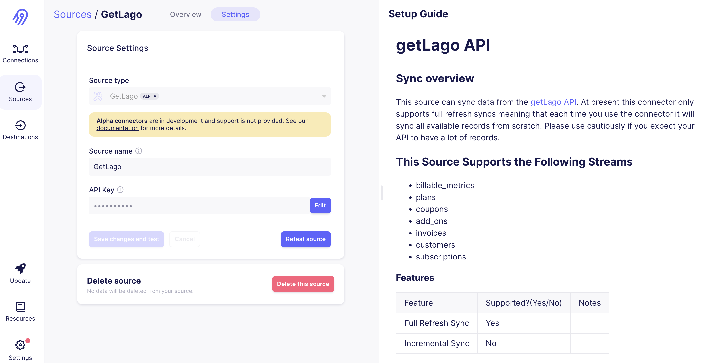
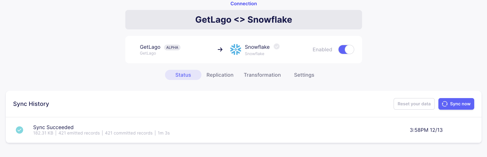
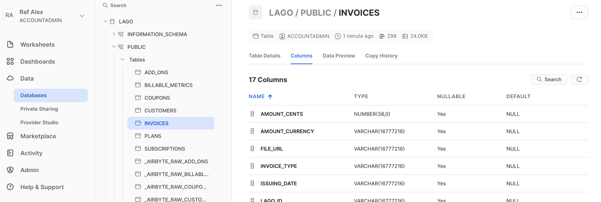
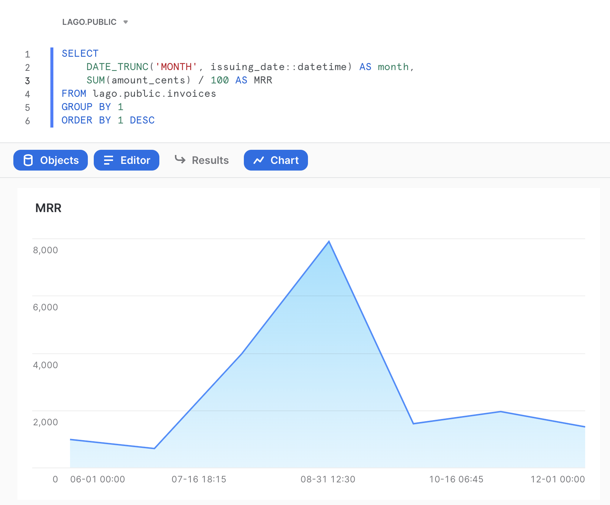

# Airbyte (ETL)

Airbyte is an open-source **data integration platform** used as an ETL. With this integration, you can connect Lago billing data to any warehouses.

## Destinations
You can push Lago billing data to destinations such as Snowflake, BigQuery, Redshift, S3 buckets or Azure, for instance.
The entire list of data destinations enabled by Airbyte is listed on their [destinations documentation](https://docs.airbyte.com/category/destinations/).

## Data available for extraction
With Airbyte's native integration of Lago, you can push the following billing data to warehouses:
- billable_metrics
- plans
- coupons
- add_ons
- invoices
- customers
- subscriptions

:::caution

At present this connector **only supports full refresh syncs** meaning that each time you use the connector it will sync all available records from scratch. Please use cautiously if you expect your API to have a lot of records.

:::

Find the full documentation of [Airbyte's native Lago integration](https://docs.airbyte.com/integrations/sources/getlago/).

## 1. Connect Lago to Airbyte
First of all, you simply need to bring your Lago private API key.
In airbyte: 
- Go to **Sources**;
- Select getLago as a source of data; and
- Paste your Lago private API key.

## 2. Select a destination
You can select any of the data destinations available in Airbyte. It could be a warehouse (BigQuery, Redshift, Snowflake...) or a file storage tool (S3, for instance). Please find here the entire list of [data destinations available in Airbyte](https://docs.airbyte.com/category/destinations/).

## 3. Sync billing data
In the following example, we connected Lago billing data to Snowflake data warehouse. Obviously, you can select another destination if needed. 

1. Create a **data sync** between Lago source and your destination;
2. Define a **sync frequency**; and
3. Activate the sync in Airbyte between Lago source and your destination.

This action will populate Lago billing data into a warehouse (Snowflake in our example).

## 4. Query Lago billing data
Once the data has been populated in your destination, a warehouse in our example, you can easily query your billing data. Here is a query calculating your monthly revenue with Lago:

