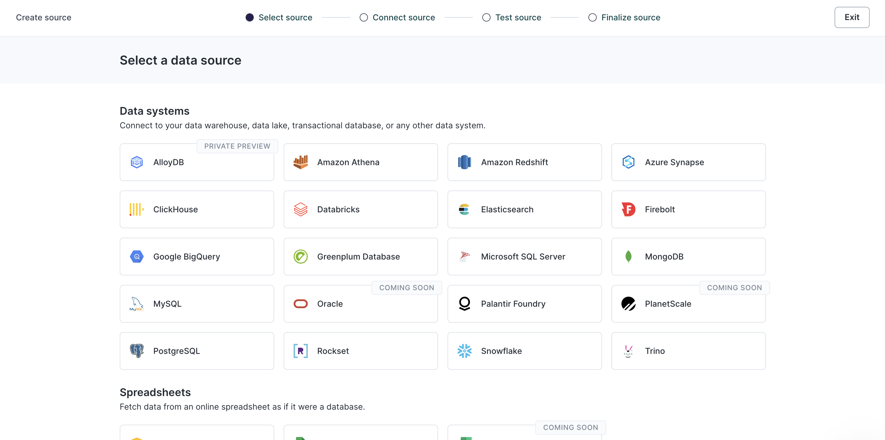
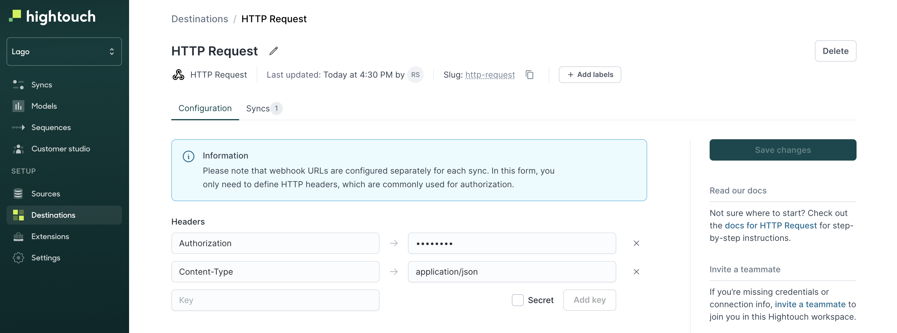
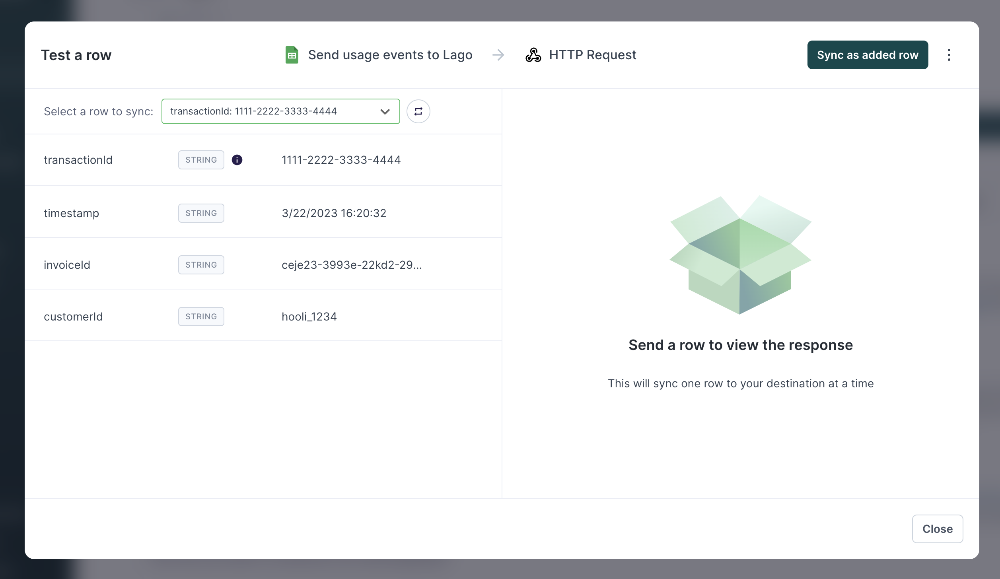

# Hightouch

<head>
  <meta property="og:image" content="../../../static/img/integration-lago-hightouch.png" />
</head>

Hightouch is a Data Activation platform that syncs data from sources (database, warehouses, spreadsheet and much more) to business applications and developer tools. This data can be sent to Lago, our usage-based billing platform, to automate your billing process and ensure accurate invoicing for your customers. Here's a step-by-step guide to help you get started:

## Prerequisites

**In Lago:**
1. Create a Lago organization to manage your billing and invoicing;
2. Create a Billable metric to track the usage of your customers;
3. Create a Plan and price the above billable metric to determine the billing rates for your customers; and
4. Create a Customer and assign the Plan.

**In Hightouch:**
1. Create a Hightouch account;
2. Create a data source (ideally, product usage of your customer);
3. Create a **HTTP Request** destination.

## Send usage from Hightouch to Lago

### Create a data source

To accomplish this, you'll need first to create a source in Hightouch. This can be done by following these simple steps:
1. Navigate to the **Sources** tab;
2. Add a **new source**; and
3. Choose and set up a data source that is available in Hightouch (it could be a database, a warehouse or a spreadsheet, for instance).



### Use the HTTP Request destination

Lago uses Hightouch's HTTP Request to ingest usage. Here is how to set it up:
1. Go to the **Destinations** tab;
2. Select the **HTTP Request** destination;
3. Define your **Headers**. Lago requires `Authorization` (secret, used for the API Key) and `Content-Type: application/json` headers; and
4. Save this newly created destination.




### Create a Sync

In order to send usage from Hightouch to Lago, you will have to create a new **Sync**. To do so, go in the **Syncs** tab and create a new sync from a source to this HTTP Request destination.

1. Configure when you want to trigger the event (row added, row deleted, row updated);
2. Define `POST` as the targeted HTTP Method;
3. Define the targeted url (for usage events, use `https://api.getlago.com/api/v1/events`);
4. Send data as `JSON` and use the JSON editor;
5. Define rate limits, if applicable

### Example of JSON payload

You can define manually the JSON payload that will be sent to Lago. Note that Hightouch supports Liquid template language to insert variables from your source to your JSON payload. These variables are created following this syntax: `"{{ row.variable }}"`, *"variable"* being the column name of your source.

Here is a JSON payload example to send usage events to Lago:
```json
{
      "event": {
          "transaction_id": "{{ row.transactionId }}",
          "external_customer_id": "{{ row.customerId }}",
          "code": "invoice_created",
          "properties": {
              "invoice_id": "{{ row.invoiceId }}"
        }
    }
}
```

:::note

The `body` structure of the event depends on your use case. Please adapt it if needed (*ie: remove or add properties*).

:::


### Test and activate your sync

Note that you can test your sync with a data sample. As a result of this test, you should see data flowing into Lago, in the events debugger. Once you are ready to go, you can activate this sync, and define the periodic trigger.




## Hightouch to Lago - demo video

If easier, please find a demo video explaining the full setup to send events from Hightouch to Lago.

<iframe width="700" height="500" src="https://www.youtube.com/embed/2NBmQYjrz40" title="YouTube video player" frameborder="0" allow="accelerometer; autoplay; clipboard-write; encrypted-media; gyroscope; picture-in-picture; web-share" allowfullscreen></iframe>