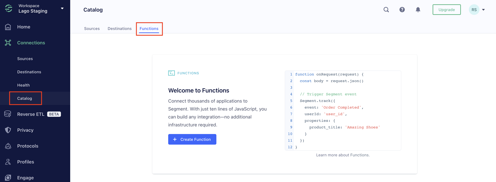
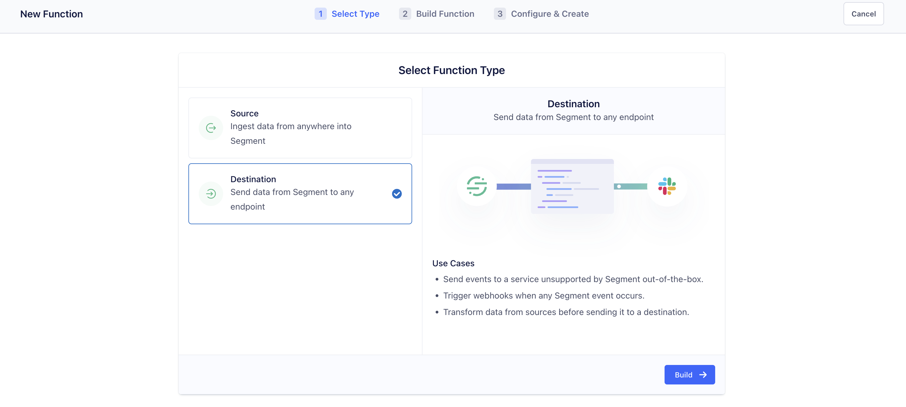
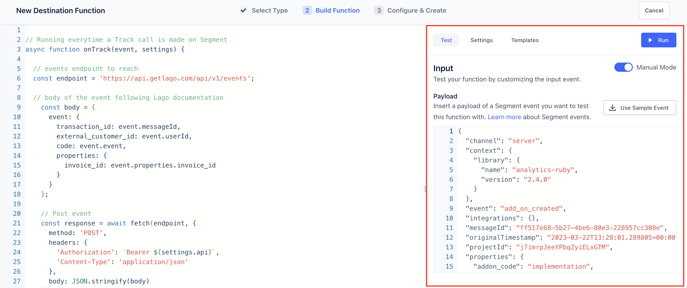
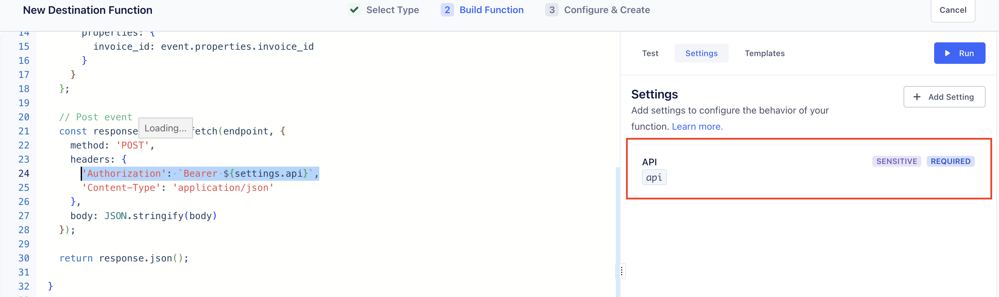

# Segment.com
Segment is a powerful tool that allows you to track the usage of your customers, providing valuable insights that can help you make data-driven decisions. This data can be sent to Lago, our usage-based billing platform, to automate your billing process and ensure accurate invoicing for your customers. Here's a step-by-step guide to help you get started:

## Prerequisites

**In Lago:**
1. Create a Lago organization to manage your billing and invoicing;
2. Create a Billable metric to track the usage of your customers;
3. Create a Plan and price the above billable metric to determine the billing rates for your customers; and
4. Create a Customer and assign the Plan.

**In Segment:**
1. Create a Segment account;
2. Create a data source (ideally, product usage of your customer);

## Send usage from Segment to Lago

### Create a function

To accomplish this, you'll need to create a custom **Function** in Segment. This can be done by following these simple steps:
1. Navigate to the **Catalog** in Segment;
2. Click the **Functions** tab to access the custom Functions feature;
3. Choose to create your first function and follow the prompts to set it up.



### Use the Destination function

Make sure to select the **Destination function**, as you want to send data from Segment to Lago.


### Post Request to Lago events

To successfully integrate Lago with Segment, you'll need to replace the pre-written functions in the code editor with the following code. This example function, written by the Lago team, will catch a **Track** event from Segment, define the targeted endpoint (events) in Lago, build the body of the request, and finally post the event.

```javascript
// Running everytime a Track call is made on Segment
async function onTrack(event, settings) {

  // events endpoint to reach
  const endpoint = 'https://api.getlago.com/api/v1/events';

  // body of the event following Lago documentation
    const body = {
      event: {
        transactionId: event.messageId,
        externalCustomerId: event.userId,
        code: event.event,
        properties: {
          invoiceId: event.properties.invoice_id
        }
      }
    };

    // Post event
    const response = await fetch(endpoint, {
      method: 'POST',
      headers: {
        'Authorization': `Bearer ${settings.api}`,
        'Content-Type': 'application/json'
      },
      body: JSON.stringify(body)
    });

    return response.json();

  }
```

:::note

This function can be adapted with Identify, Group or Page events. Please, refer to [Segment's documentation](https://segment.com/docs/connections/functions/destination-functions/) for all available actions.

:::

:::note

The `body` structure of the event depends on your use case. Please adapt it if needed (*ie: remove or add properties*). You can also add conditions if you want to send data to Lago only on specific events.

:::

### Use the test mode editor

By using a sample event, you can preview the incoming data fetched from a Segment event. This will help you post a request for existing data or debug.


### Hide sensitive data

Let's take back the example from the code written above. We decided to hide the **API Key** and mark it as sensitive information. By setting this as a variable, you make sure not to hard code your private key in the function.

To create **Settings** variables: 
1. Go to the **Settings** tab;
2. **Add** a new Setting;
3. Define a **Name** and a **Label** for this Settings;
4. Define it as **Required** or **Optional**; and
5. Mark is as **Sensitive** or not.





### Send usage events to Lago

By running the function in Segment, this will send a test usage to Lago events. You can retrieve this event in the events list. By finalizing the setup in Segment, the function will be automatically triggered based on your defined behavior

## Segment to Lago - demo video

If easier, please find a demo video explaining the full setup of custom functions to send event from Segment.com to Lago.

<iframe width="700" height="500" src="https://www.youtube.com/embed/lyJmdh47JTE" title="YouTube video player" frameborder="0" allow="accelerometer; autoplay; clipboard-write; encrypted-media; gyroscope; picture-in-picture; web-share" allowfullscreen></iframe>