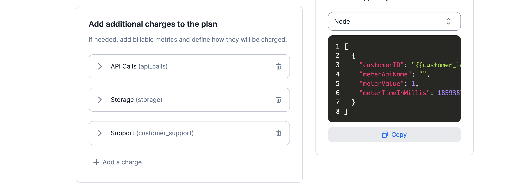

# Charges
In addition to the price of a Plan, your Customers could pay for per-usage features. For instance, they could pay for API calls, storage, computes...

**This additional charges are related to the Billable metrics you already defined**. If you don't know how Billable metrics work for "pay-as-you-go" features, please visit [this section of the documentation](../billable-metrics/overview.md). Obviously, this additional charges related to your Billable metrics can be priced differently regarding the Plans they belong to.

## Overview of charges
You can add Charges to a Plan by calling an existing Billable metric (you will need to define how you want to price this addtional Charge).

These additional charges are often "pay-as-you-go" features and can be called in multiple Plans with a different price.

:::caution
- This additional charges are always paid `in arrears` because they are linked to an actual consumption
- This additional charges **are priced with the same currency** than the Plan's currency
- The additional charges **are not subject to the trial period**. The trial period is only for the Plan base amount
:::

You have several charge model options to price these additional charges (following below).

## The `Standard` charge model
Select a **standard charge model** if you charge the same price for each unit consumed. This charge model can be applied only for additional charges triggered by your [Billable metrics](../billable-metrics/overview.md).

For instance, let's imagine you are an API company charging $0.05 for each API call (your defined Billable metric). By selecting a standard charge model, each API call will be charged the same amount. If a customer does 1000 API calls during a billing period, the total amount invoiced will be $50 ($0.05 x 1000 API calls).